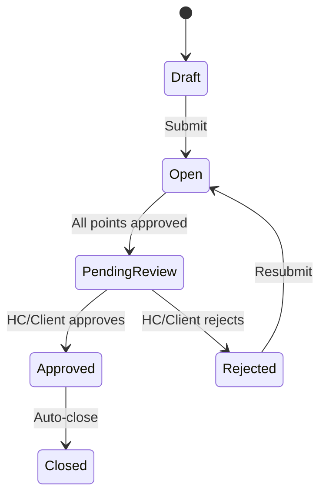

# Design Document: Comprehensive Documentation

## Overview

This design defines the structure, content organization, and document templates for a complete documentation suite covering the Construction Quality Management application. The documentation is purely markdown-based, requiring no code changes to the application itself. It targets two audiences: technical (developers, DevOps) and non-technical (Project Managers, QA Managers, Superintendents, Clients).

The documentation lives in a `docs/` folder at the repository root, with the root `README.md` serving as the entry point. All 12 application features are documented with equal depth based on their importance to the system's core purpose.

## Architecture

### Documentation Structure

```
├── README.md                          # Root README (project entry point)
└── docs/
    ├── README.md                      # Documentation index / table of contents
    ├── architecture.md                # System architecture overview
    ├── features.md                    # Feature overview (all 12 features)
    ├── glossary.md                    # Construction QA + technical glossary
    ├── api/
    │   ├── README.md                  # API documentation index
    │   ├── authentication.md          # Auth endpoints
    │   ├── projects.md                # Project endpoints
    │   ├── templates.md               # Template endpoints
    │   ├── itps.md                    # ITP instance endpoints
    │   ├── ncrs.md                    # NCR endpoints
    │   ├── media.md                   # Media endpoints
    │   ├── invitations.md             # Invitation endpoints
    │   ├── external-sign-off.md       # External sign-off endpoints
    │   ├── users.md                   # User management endpoints
    │   ├── witness-points.md          # Witness point notification endpoints
    │   └── logos.md                   # Logo endpoints
    ├── database/
    │   ├── README.md                  # Schema documentation + ER diagram
    │   └── migrations.md             # Migration history
    ├── adr/
    │   ├── README.md                  # ADR index
    │   ├── 001-serverless-express.md
    │   ├── 002-s3-notification-pattern.md
    │   ├── 003-eventbridge-auto-waivers.md
    │   ├── 004-jwt-rbac.md
    │   ├── 005-external-sign-off-tokens.md
    │   ├── 006-pdf-generation-jspdf.md
    │   ├── 007-monorepo-structure.md
    │   └── 008-cloudfront-s3-spa.md
    ├── user-guide/
    │   ├── README.md                  # User guide index
    │   ├── getting-started.md         # Login, registration, password reset
    │   ├── itp-management.md          # ITP lifecycle and execution
    │   ├── template-management.md     # Template creation and library
    │   ├── ncr-management.md          # NCR lifecycle
    │   ├── media-management.md        # File uploads and attachments
    │   ├── witness-points.md          # WP notifications and responses
    │   ├── external-sign-off.md       # External approvals
    │   ├── project-management.md      # Projects and dashboard
    │   ├── pdf-reports.md             # Report generation
    │   ├── user-administration.md     # User/role management (Admin)
    │   └── roles-permissions.md       # Role-specific permission matrix
    ├── workflows/
    │   ├── README.md                  # Workflow diagrams index
    │   ├── itp-lifecycle.md           # ITP state machine diagram
    │   ├── point-sign-off.md          # Point approval flow
    │   ├── ncr-lifecycle.md           # NCR state machine diagram
    │   ├── witness-point-flow.md      # WP notification + auto-waiver
    │   ├── external-sign-off.md       # Token-based external approval
    │   ├── user-onboarding.md         # Invitation → registration flow
    │   └── media-upload.md            # Presigned URL upload flow
    └── release-notes/
        ├── README.md                  # Release notes index
        └── TEMPLATE.md               # Release notes template
```

### Design Decisions

1. **Split API docs by domain** — One file per controller/domain keeps each document focused and navigable. A single monolithic API doc would exceed 2000 lines.

2. **Mermaid for all diagrams** — Renders natively in GitHub, VS Code, and most documentation tools without external image hosting.

3. **User guide organized by workflow** — Non-technical users think in tasks ("How do I raise an NCR?"), not in system components.

4. **ADRs as numbered files** — Standard ADR convention. Numbered for chronological ordering, titled for discoverability.

5. **Separate workflows/ folder** — Diagrams are reusable across user guide and technical docs. Keeping them separate avoids duplication.

## Components and Interfaces

### Component 1: Root README (README.md)

**Purpose:** First thing a developer sees. Provides quick orientation and setup.

**Sections:**
- Project title and one-line description
- Technology stack table (tool, version, purpose)
- Prerequisites (Node.js 20+, PostgreSQL 15+, AWS CLI v2)
- Quick start (clone, install, configure .env, migrate, seed, run)
- Project structure tree (backend/, frontend/, infrastructure/, e2e/, docs/)
- Available scripts table (dev, build, test, lint, deploy)
- Link to docs/ for detailed documentation

### Component 2: API Documentation (docs/api/)

**Purpose:** Complete REST API reference for all 60+ endpoints.

**Per-endpoint format:**
```markdown
### POST /api/auth/login

**Authentication:** None  
**Rate Limit:** 10 req/min

**Request Body:**
| Field    | Type   | Required | Description       |
|----------|--------|----------|-------------------|
| email    | string | Yes      | User email        |
| password | string | Yes      | User password     |

**Success Response (200):**
```json
{
  "token": "eyJhbG...",
  "user": { "id": 1, "email": "...", "role": "Admin" }
}
```

**Error Responses:**
| Status | Description            |
|--------|------------------------|
| 401    | Invalid credentials    |
| 429    | Rate limit exceeded    |
```

**Organization:** One file per domain (auth, projects, templates, itps, ncrs, media, invitations, external-sign-off, users, witness-points, logos). Index file links to all and provides authentication overview.

### Component 3: Database Schema Documentation (docs/database/)

**Purpose:** Complete reference for all tables, relationships, enums, and migrations.

**Per-table format:**
- Table name and purpose
- Column table (name, type, constraints, description)
- Foreign key relationships
- Indexes

**ER Diagram:** Full Mermaid erDiagram showing all 20+ tables and their relationships.

**Migration History:** Chronological list of all 7 migrations with description of changes introduced.

### Component 4: Architecture Decision Records (docs/adr/)

**Purpose:** Document the "why" behind key technical choices.

**ADR Template:**
```markdown
# ADR-NNN: Title

## Status
Accepted

## Context
[Problem or situation that required a decision]

## Decision
[What was decided and why]

## Consequences
[Positive and negative outcomes of this decision]
```

**8 ADRs covering:** Serverless Express, S3 notification pattern, EventBridge auto-waivers, JWT/RBAC, external sign-off tokens, jsPDF generation, monorepo structure, CloudFront SPA hosting.

### Component 5: Architecture Overview (docs/architecture.md)

**Purpose:** System-level view of how all components interact.

**Diagrams (Mermaid):**
1. System context diagram — Browser, CloudFront, Lambda, RDS, S3, SES, EventBridge
2. Request flow — Browser → CloudFront → Lambda Function URL → Express → PostgreSQL
3. Notification flow — Backend Lambda → S3 JSON → S3 Event → Notifier Lambda → SES
4. WP timer flow — Backend → EventBridge Schedule → WP Timer Lambda → Backend API
5. Media upload flow — Frontend → Backend (presigned URL) → Frontend → S3 direct upload
6. Deployment diagram — VPC, subnets, security groups, Lambda functions, RDS

### Component 6: User Guide (docs/user-guide/)

**Purpose:** Task-oriented documentation for non-technical users.

**Per-section format:**
- Brief introduction explaining the feature's purpose
- Step-by-step instructions with expected outcomes
- Role-specific notes (who can do what)
- Tips and common questions

**Roles-permissions matrix:** Table showing all actions × all roles with ✓/✗ indicators.

### Component 7: Feature Overview (docs/features.md)

**Purpose:** High-level summary of all 12 features for any audience.

**Organization by domain:**
- Quality Execution: ITP Management, NCR Management, Media Management
- Quality Planning: Template Management, Professional PDF Reports
- Collaboration: Witness Point Notifications, External Sign-Offs
- Administration: User Management, Invitations & Onboarding, Authentication & Authorization, Project Management, Audit Trail

**Per-feature format:**
- Feature name
- One-paragraph description
- Key capabilities (bullet list)
- Roles involved

### Component 8: Workflow Diagrams (docs/workflows/)

**Purpose:** Visual representation of key business processes.

**All diagrams use Mermaid stateDiagram-v2 or sequenceDiagram syntax.**

Example (ITP lifecycle):


### Component 9: Glossary (docs/glossary.md)

**Purpose:** Bridge between construction QA domain language and application concepts.

**Organization:** Three sections (Construction QA, Application Workflow, Technical Infrastructure), alphabetical within each.

### Component 10: Release Notes (docs/release-notes/)

**Purpose:** Standardized change documentation per version.

**Template sections:** Version, Date, Summary, New Features, Improvements, Bug Fixes, Breaking Changes, Migration Steps, Known Issues.

## Data Models

This feature produces only markdown files — no database changes or data models are required. The "data" is the documentation content itself, structured as described in the Architecture section above.

### Document Metadata Convention

Each major document includes a YAML-style header comment for maintainability:

```markdown
<!-- 
  Last Updated: YYYY-MM-DD
  Covers: v1.0 of the application
  Maintainer: [team/person]
-->
```

## Error Handling

Since this feature produces static documentation files, traditional error handling does not apply. Instead, the following quality controls are defined:

1. **Broken links** — All internal links between documents use relative paths. The docs/README.md index serves as the canonical link registry.

2. **Stale content** — Each document includes a "Last Updated" metadata comment. The release notes workflow prompts documentation review.

3. **Incomplete coverage** — The feature overview and API docs are structured to cover all 12 features and all 60+ endpoints. Missing sections are immediately visible in the table of contents.

4. **Mermaid rendering failures** — All diagrams use simple Mermaid syntax (stateDiagram-v2, sequenceDiagram, erDiagram) compatible with GitHub's native renderer.

## Testing Strategy

Property-based testing does not apply to this feature. The deliverables are static markdown files with no executable logic, no parsers, no data transformations, and no functions with inputs/outputs.

### Validation Approach

1. **Link validation** — Verify all internal markdown links resolve to existing files. Can be automated with a simple script or CI check (e.g., `markdown-link-check`).

2. **Mermaid syntax validation** — Verify all Mermaid diagrams render without errors. Can be validated with `mermaid-cli` or by visual inspection in GitHub preview.

3. **Content completeness review** — Manual checklist ensuring:
   - All 12 features documented in feature overview
   - All 60+ endpoints documented in API reference
   - All 20+ tables documented in schema reference
   - All 7 migrations documented
   - All 8 ADRs written
   - All 7 workflow diagrams created
   - All user guide sections cover all 4 roles

4. **Formatting consistency** — All documents follow the same markdown conventions (heading levels, table formatting, code block language tags).

5. **Accuracy verification** — Cross-reference API documentation against actual route definitions in `backend/src/routes/`. Cross-reference schema documentation against `backend/database/schema.sql` and migration files.
