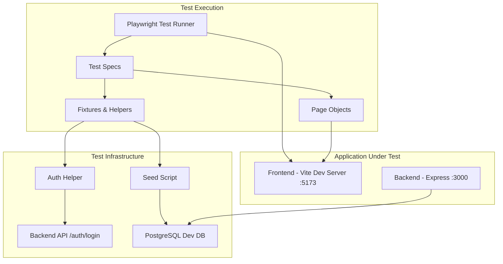
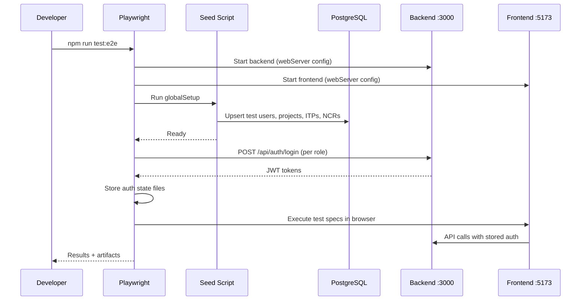
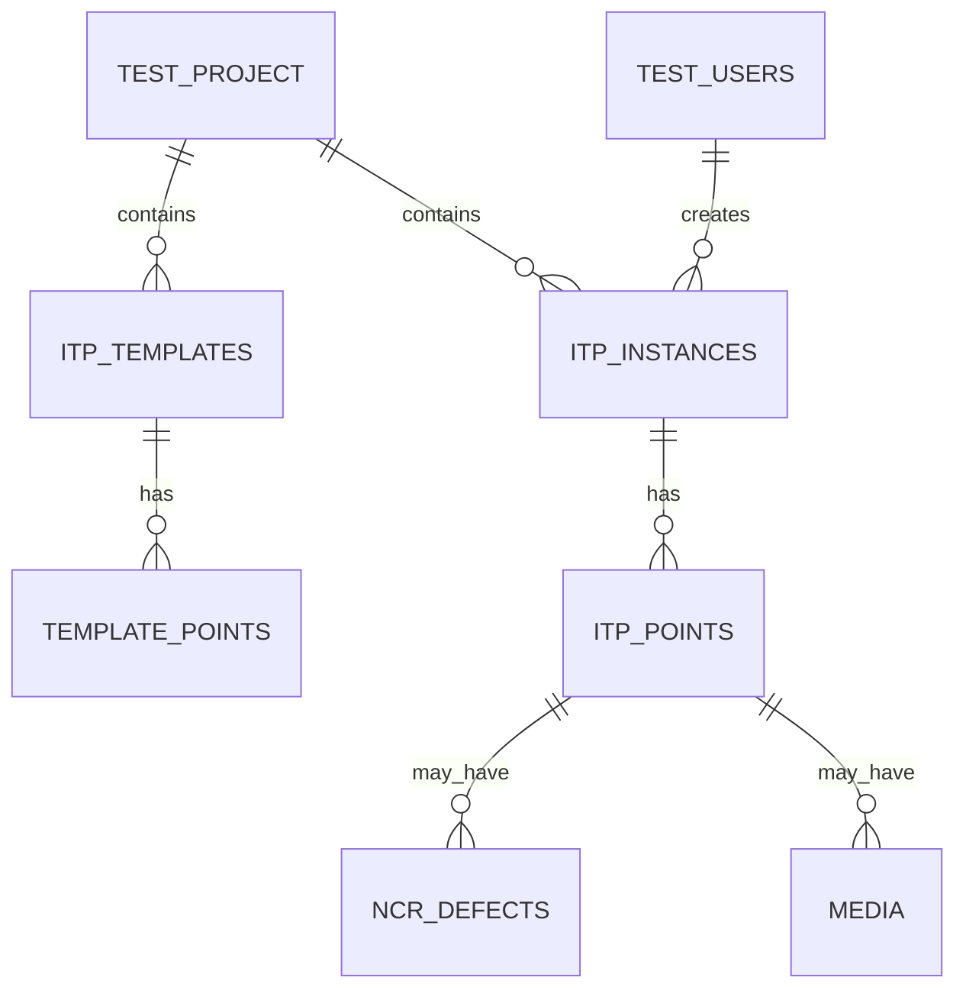

# Design Document: E2E Testing Framework

## Overview

This design describes a Playwright-based end-to-end testing framework for the Construction Quality Management App. The framework runs against the existing development database (no separate test DB), uses a Page Object pattern for maintainability, and integrates into CI via GitHub Actions.

The key design decisions are:
1. **Monorepo-root placement** — Playwright config and the `e2e/` directory live at the project root since tests span both frontend and backend.
2. **Direct dev database** — The seed script uses upsert logic to ensure deterministic test data exists without duplicating or requiring a separate database.
3. **API-based auth** — Authentication fixtures call the login API directly and store state files, avoiding repeated UI login flows.
4. **Page Object Model** — Each page gets a class encapsulating selectors and actions, keeping tests readable and resilient to UI changes.

## Architecture



### Execution Flow



## Components and Interfaces

### Directory Structure

```
project-root/
├── e2e/
│   ├── fixtures/
│   │   ├── auth.fixture.ts        # Auth setup fixture (per-role browser contexts)
│   │   └── base.fixture.ts        # Extended test with all custom fixtures
│   ├── helpers/
│   │   ├── auth.helper.ts         # API-based login, token storage
│   │   └── seed.ts                # Database seeding with upsert logic
│   ├── pages/
│   │   ├── login.page.ts
│   │   ├── dashboard.page.ts
│   │   ├── project-details.page.ts
│   │   ├── template-builder.page.ts
│   │   ├── template-library.page.ts
│   │   ├── itp-execution.page.ts
│   │   ├── ncr-list.page.ts
│   │   ├── ncr-detail.page.ts
│   │   ├── user-management.page.ts
│   │   ├── external-sign-off.page.ts
│   │   ├── witness-point-response.page.ts
│   │   ├── register.page.ts
│   │   ├── forgot-password.page.ts
│   │   └── reset-password.page.ts
│   ├── tests/
│   │   ├── auth/
│   │   │   └── login.spec.ts
│   │   ├── projects/
│   │   │   └── dashboard.spec.ts
│   │   ├── itps/
│   │   │   ├── template-builder.spec.ts
│   │   │   ├── template-library.spec.ts
│   │   │   └── itp-execution.spec.ts
│   │   ├── ncrs/
│   │   │   └── ncr-lifecycle.spec.ts
│   │   ├── witness-points/
│   │   │   └── wp-notifications.spec.ts
│   │   ├── external-sign-off/
│   │   │   └── external-sign-off.spec.ts
│   │   ├── media/
│   │   │   └── media-upload.spec.ts
│   │   ├── users/
│   │   │   └── user-management.spec.ts
│   │   └── rbac/
│   │       └── role-access.spec.ts
│   ├── test-data/
│   │   └── constants.ts            # Seeded user credentials, IDs, project names
│   └── templates/
│       └── feature-test.template.ts # Copy-paste template for new feature tests
├── playwright.config.ts
├── .playwright/                     # gitignored: auth state, artifacts
└── package.json                     # root package.json with e2e scripts
```

### Playwright Configuration

```typescript
// playwright.config.ts
import { defineConfig, devices } from '@playwright/test';

export default defineConfig({
  testDir: './e2e/tests',
  fullyParallel: true,
  forbidOnly: !!process.env.CI,
  retries: process.env.CI ? 2 : 0,
  workers: process.env.CI ? 2 : undefined,
  reporter: [
    ['html', { outputFolder: '.playwright/report' }],
    ['list'],
  ],
  outputDir: '.playwright/results',

  use: {
    baseURL: 'http://localhost:5173',
    trace: 'on-first-retry',
    screenshot: 'only-on-failure',
    video: 'retain-on-failure',
  },

  projects: [
    // Setup project: seeds DB and creates auth state files
    {
      name: 'setup',
      testMatch: /global\.setup\.ts/,
    },
    {
      name: 'chromium',
      use: { ...devices['Desktop Chrome'] },
      dependencies: ['setup'],
    },
    {
      name: 'firefox',
      use: { ...devices['Desktop Firefox'] },
      dependencies: ['setup'],
    },
    {
      name: 'webkit',
      use: { ...devices['Desktop Safari'] },
      dependencies: ['setup'],
    },
  ],

  webServer: [
    {
      command: 'npm run start',
      cwd: './backend',
      port: 3000,
      reuseExistingServer: !process.env.CI,
      env: { NODE_ENV: 'test' },
    },
    {
      command: 'npm run dev',
      cwd: './frontend',
      port: 5173,
      reuseExistingServer: !process.env.CI,
    },
  ],
});
```

### Page Object Pattern

Each page object encapsulates locators and common interactions:

```typescript
// e2e/pages/login.page.ts
import { Page, Locator } from '@playwright/test';

export class LoginPage {
  readonly page: Page;
  readonly emailInput: Locator;
  readonly passwordInput: Locator;
  readonly submitButton: Locator;
  readonly errorMessage: Locator;
  readonly forgotPasswordLink: Locator;

  constructor(page: Page) {
    this.page = page;
    this.emailInput = page.locator('input[type="email"]');
    this.passwordInput = page.locator('input[type="password"]');
    this.submitButton = page.locator('button[type="submit"]');
    this.errorMessage = page.locator('.error');
    this.forgotPasswordLink = page.locator('a[href="/forgot-password"]');
  }

  async goto() {
    await this.page.goto('/login');
  }

  async login(email: string, password: string) {
    await this.emailInput.fill(email);
    await this.passwordInput.fill(password);
    await this.submitButton.click();
  }
}
```

```typescript
// e2e/pages/dashboard.page.ts
import { Page, Locator } from '@playwright/test';

export class DashboardPage {
  readonly page: Page;
  readonly welcomeHeading: Locator;
  readonly logoutButton: Locator;
  readonly userManagementLink: Locator;
  readonly projectCards: Locator;
  readonly statCards: Locator;

  constructor(page: Page) {
    this.page = page;
    this.welcomeHeading = page.locator('h1');
    this.logoutButton = page.locator('button', { hasText: 'Logout' });
    this.userManagementLink = page.locator('a[href="/admin/users"]');
    this.projectCards = page.locator('.project-card');
    this.statCards = page.locator('.stat-card');
  }

  async goto() {
    await this.page.goto('/');
  }

  async getWelcomeText(): Promise<string> {
    return this.welcomeHeading.textContent() ?? '';
  }
}
```

### Auth Helper and Fixtures

```typescript
// e2e/helpers/auth.helper.ts
import { request } from '@playwright/test';
import path from 'path';
import fs from 'fs';
import { TEST_USERS } from '../test-data/constants';

const AUTH_DIR = path.join(process.cwd(), '.playwright', '.auth');

export type UserRole = 'subcontractor' | 'headContractor' | 'client' | 'admin';

export async function authenticateRole(role: UserRole): Promise<string> {
  const user = TEST_USERS[role];
  const context = await request.newContext({
    baseURL: 'http://localhost:3000',
  });

  const response = await context.post('/api/auth/login', {
    data: { email: user.email, password: user.password },
  });

  const body = await response.json();
  await context.dispose();
  return body.token;
}

export async function setupAuthState(role: UserRole): Promise<string> {
  const storageFile = path.join(AUTH_DIR, `${role}.json`);
  fs.mkdirSync(AUTH_DIR, { recursive: true });

  const token = await authenticateRole(role);

  // Store as Playwright storage state format
  const storageState = {
    cookies: [],
    origins: [
      {
        origin: 'http://localhost:5173',
        localStorage: [
          { name: 'token', value: token },
          { name: 'user', value: JSON.stringify(TEST_USERS[role]) },
        ],
      },
    ],
  };

  fs.writeFileSync(storageFile, JSON.stringify(storageState, null, 2));
  return storageFile;
}
```

```typescript
// e2e/fixtures/auth.fixture.ts
import { test as base, BrowserContext } from '@playwright/test';
import path from 'path';

type AuthFixtures = {
  subcontractorContext: BrowserContext;
  headContractorContext: BrowserContext;
  clientContext: BrowserContext;
  adminContext: BrowserContext;
};

export const test = base.extend<AuthFixtures>({
  subcontractorContext: async ({ browser }, use) => {
    const context = await browser.newContext({
      storageState: path.join(process.cwd(), '.playwright', '.auth', 'subcontractor.json'),
    });
    await use(context);
    await context.close();
  },
  headContractorContext: async ({ browser }, use) => {
    const context = await browser.newContext({
      storageState: path.join(process.cwd(), '.playwright', '.auth', 'headContractor.json'),
    });
    await use(context);
    await context.close();
  },
  clientContext: async ({ browser }, use) => {
    const context = await browser.newContext({
      storageState: path.join(process.cwd(), '.playwright', '.auth', 'client.json'),
    });
    await use(context);
    await context.close();
  },
  adminContext: async ({ browser }, use) => {
    const context = await browser.newContext({
      storageState: path.join(process.cwd(), '.playwright', '.auth', 'admin.json'),
    });
    await use(context);
    await context.close();
  },
});

export { expect } from '@playwright/test';
```

### Seed Script

The seed script uses upsert logic (INSERT ... ON CONFLICT) to ensure idempotency:

```typescript
// e2e/helpers/seed.ts
import { Pool } from 'pg';
import bcrypt from 'bcryptjs';
import { TEST_USERS, TEST_PROJECT, TEST_TEMPLATE } from '../test-data/constants';

export async function seedTestData(): Promise<void> {
  const pool = new Pool({
    user: process.env.DB_USER || 'postgres',
    host: process.env.DB_HOST || 'localhost',
    database: process.env.DB_NAME || 'itpapp',
    password: process.env.DB_PASSWORD || 'password',
    port: parseInt(process.env.DB_PORT || '5432'),
  });

  try {
    // Upsert test users (one per role)
    for (const [, user] of Object.entries(TEST_USERS)) {
      const hash = await bcrypt.hash(user.password, 10);
      await pool.query(
        `INSERT INTO users (email, full_name, password_hash, role_id, is_active)
         VALUES ($1, $2, $3, $4, true)
         ON CONFLICT (email) DO UPDATE SET
           password_hash = EXCLUDED.password_hash,
           full_name = EXCLUDED.full_name,
           is_active = true`,
        [user.email, user.fullName, hash, user.roleId]
      );
    }

    // Upsert test project
    await pool.query(
      `INSERT INTO projects (id, name, description)
       VALUES ($1, $2, $3)
       ON CONFLICT (id) DO UPDATE SET
         name = EXCLUDED.name,
         description = EXCLUDED.description`,
      [TEST_PROJECT.id, TEST_PROJECT.name, TEST_PROJECT.description]
    );

    // Upsert ITP template with points of each type
    // ... (template, instance, NCR seeding follows same pattern)

  } finally {
    await pool.end();
  }
}
```

### Test Data Constants

```typescript
// e2e/test-data/constants.ts
export const TEST_USERS = {
  subcontractor: {
    email: 'e2e-subcontractor@test.local',
    password: 'TestPass123!',
    fullName: 'E2E Subcontractor',
    roleId: 1,
  },
  headContractor: {
    email: 'e2e-headcontractor@test.local',
    password: 'TestPass123!',
    fullName: 'E2E Head Contractor',
    roleId: 2,
  },
  client: {
    email: 'e2e-client@test.local',
    password: 'TestPass123!',
    fullName: 'E2E Client',
    roleId: 3,
  },
  admin: {
    email: 'e2e-admin@test.local',
    password: 'TestPass123!',
    fullName: 'E2E Admin',
    roleId: 4,
  },
} as const;

export const TEST_PROJECT = {
  id: 9000,
  name: 'E2E Test Project',
  description: 'Automated testing project — do not delete',
};

export const TEST_TEMPLATE = {
  id: 9000,
  name: 'E2E Test Template',
  projectId: 9000,
};

export const DEACTIVATED_USER = {
  email: 'e2e-deactivated@test.local',
  password: 'TestPass123!',
  fullName: 'E2E Deactivated User',
  roleId: 1,
};
```

### Global Setup (Seed + Auth)

```typescript
// e2e/global.setup.ts
import { test as setup } from '@playwright/test';
import { seedTestData } from './helpers/seed';
import { setupAuthState } from './helpers/auth.helper';

setup('seed database and create auth states', async () => {
  // 1. Seed deterministic test data
  await seedTestData();

  // 2. Create auth state files for each role
  await setupAuthState('subcontractor');
  await setupAuthState('headContractor');
  await setupAuthState('client');
  await setupAuthState('admin');
});
```

## Data Models

### Test User Model

| Field | Type | Description |
|-------|------|-------------|
| email | string | Unique email for the test user |
| password | string | Plaintext password (hashed during seed) |
| fullName | string | Display name |
| roleId | number | 1=Subcontractor, 2=Head Contractor, 3=Client, 4=Admin |

### Auth Storage State

Playwright's storage state format is used to inject authenticated sessions:

```json
{
  "cookies": [],
  "origins": [
    {
      "origin": "http://localhost:5173",
      "localStorage": [
        { "name": "token", "value": "<jwt>" },
        { "name": "user", "value": "{...}" }
      ]
    }
  ]
}
```

This matches how the frontend stores auth — the `AuthContext` reads `token` and `user` from localStorage.

### Seeded Test Data Relationships



Seeded data includes:
- 4 test users (one per role) + 1 deactivated user
- 1 project (id: 9000)
- 1 template with 5 points (one of each type: HP, WP, RP, SP, IP)
- 4 ITP instances (Draft, Pending Review, Open, Closed)
- 1 open NCR + 1 closed NCR linked to ITP points

## Error Handling

| Scenario | Handling Strategy |
|----------|-------------------|
| Backend not ready when tests start | Playwright `webServer` config waits for port availability with timeout |
| Database connection failure in seed | Seed script throws with clear error message; global setup fails fast |
| Auth token expired mid-test | Frontend interceptor redirects to login; test detects unexpected navigation and fails with descriptive error |
| Flaky element not found | Use Playwright auto-waiting (default 30s timeout); retries in CI (2 retries) |
| Port conflict (3000 or 5173 in use) | `reuseExistingServer: true` locally allows running against already-started servers |
| Seed data conflicts with manual data | High IDs (9000+) and `@test.local` emails avoid collision with real dev data |
| CI service container not ready | GitHub Actions `options: --health-cmd` ensures PG is healthy before tests run |

## Testing Strategy

### Approach

This feature is an E2E testing framework itself — its "tests" are the Playwright test suites it produces. Verification of the framework is done through:

1. **Smoke test** — A minimal test (`login.spec.ts`) that validates the full pipeline works: seed → auth → navigate → assert.
2. **Example-based E2E tests** — Each feature area gets specific scenario tests verifying concrete user workflows.
3. **CI validation** — The GitHub Actions workflow is the integration test for the framework itself.

**Why no property-based testing:** E2E tests verify specific user workflows through a browser. The inputs are concrete (specific users, specific pages, specific actions) and behavior doesn't vary meaningfully with random input. Running 100 iterations of "login with valid credentials" adds no value over running it once. PBT is not applicable to this feature.

### Test Organization by Feature Area

| Directory | Feature | Priority |
|-----------|---------|----------|
| `auth/` | Login, registration, password reset | @critical |
| `projects/` | Dashboard, project details | @smoke |
| `itps/` | Template builder, library, ITP execution | @critical |
| `ncrs/` | NCR creation, lifecycle | @regression |
| `witness-points/` | WP notifications, responses | @regression |
| `external-sign-off/` | Token-based external approvals | @regression |
| `media/` | File upload with GPS | @regression |
| `users/` | User management, invitations | @regression |
| `rbac/` | Role-based access control | @critical |

### Test Tagging

Tests use Playwright annotations for selective execution:

```typescript
test('should redirect to dashboard after valid login @smoke @critical', async ({ page }) => {
  // ...
});
```

Run by tag: `npx playwright test --grep @smoke`

### CI/CD Workflow

```yaml
# .github/workflows/e2e.yml
name: E2E Tests
on:
  pull_request:
    branches: [main]

jobs:
  e2e:
    runs-on: ubuntu-latest
    timeout-minutes: 15
    services:
      postgres:
        image: postgres:16
        env:
          POSTGRES_DB: itpapp
          POSTGRES_USER: postgres
          POSTGRES_PASSWORD: password
        ports:
          - 5432:5432
        options: >-
          --health-cmd pg_isready
          --health-interval 10s
          --health-timeout 5s
          --health-retries 5

    steps:
      - uses: actions/checkout@v4

      - uses: actions/setup-node@v4
        with:
          node-version: 20
          cache: npm

      - name: Install dependencies
        run: |
          npm ci
          cd backend && npm ci
          cd ../frontend && npm ci

      - name: Run database migrations
        run: node backend/src/migrate-logic.js
        env:
          DB_HOST: localhost
          DB_USER: postgres
          DB_PASSWORD: password
          DB_NAME: itpapp
          DB_PORT: 5432

      - name: Install Playwright browsers
        run: npx playwright install --with-deps chromium

      - name: Run E2E tests
        run: npx playwright test --project=chromium
        env:
          DB_HOST: localhost
          DB_USER: postgres
          DB_PASSWORD: password
          DB_NAME: itpapp
          DB_PORT: 5432
          JWT_SECRET: e2e-test-secret
          NODE_ENV: test
          APP_URL: http://localhost:5173

      - name: Upload test artifacts
        if: failure()
        uses: actions/upload-artifact@v4
        with:
          name: playwright-report
          path: .playwright/
          retention-days: 7
```

### Test-First Workflow Integration with Specs

When a new feature spec is created:

1. **Tasks phase** includes "Write E2E tests" as the first implementation task
2. Developer copies `e2e/templates/feature-test.template.ts` to the appropriate feature directory
3. Developer writes failing tests based on the spec's acceptance criteria
4. Developer implements the feature until tests pass
5. Tests become the regression suite for that feature

The template file provides:

```typescript
// e2e/templates/feature-test.template.ts
import { test, expect } from '../fixtures/auth.fixture';
import { TEST_USERS } from '../test-data/constants';

// Instructions:
// 1. Copy this file to e2e/tests/{feature-area}/{feature}.spec.ts
// 2. Replace placeholders with actual page objects and assertions
// 3. Write tests BEFORE implementing the feature
// 4. Each test should map to one acceptance criterion from the spec

test.describe('Feature: [FEATURE_NAME]', () => {
  test('should [expected behavior] when [condition] @regression', async ({ page }) => {
    // Arrange: navigate to the relevant page
    // Act: perform the user action
    // Assert: verify the expected outcome
  });
});
```

### NPM Scripts (root package.json)

```json
{
  "scripts": {
    "test:e2e": "playwright test",
    "test:e2e:headed": "playwright test --headed",
    "test:e2e:ui": "playwright test --ui",
    "test:e2e:smoke": "playwright test --grep @smoke",
    "test:e2e:critical": "playwright test --grep @critical",
    "test:e2e:chromium": "playwright test --project=chromium"
  }
}
```
