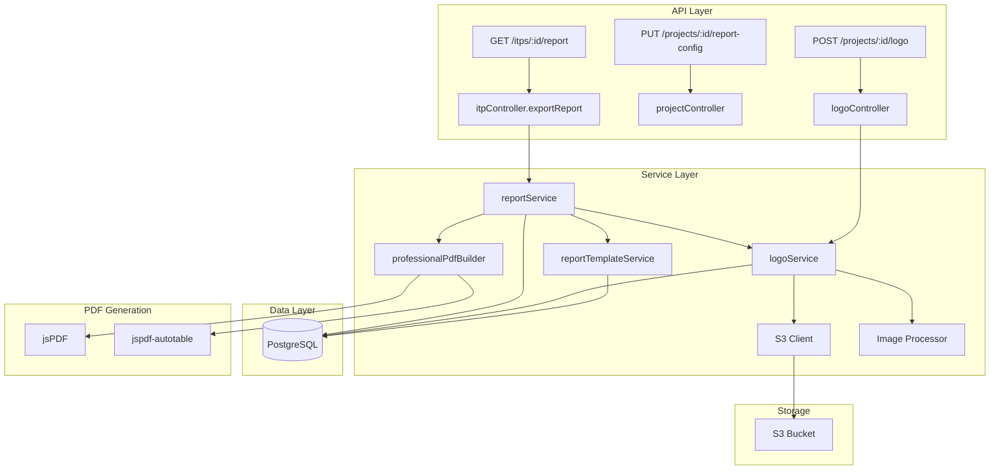

# Design Document: Professional PDF Reports

## Overview

This feature transforms the existing basic ITP report (landscape A4, simple header, basic table) into a professional-grade Inspection & Test Certificate (ITC) matching civil infrastructure standards. The design introduces:

1. **Logo management** — upload, validate, resize, and store company logos for PDF embedding
2. **Report template configuration** — per-project settings for branding, document numbering, and metadata
3. **Professional PDF layout** — portrait A4 with structured header grid, colour-coded inspection table, reference document consolidation, NCR summary, audit trail, and proper page management

The implementation extends the existing `reportService.js` with a new PDF builder while maintaining backward compatibility with the current `generateITPReport` and `generateITPReportBuffer` API.

## Architecture



### Key Architectural Decisions

1. **Separate `logoService` from `reportService`** — Logo management (upload, validate, resize, retrieve) is a distinct concern from PDF generation. This allows logo reuse in other contexts (email headers, web UI) without coupling to the report pipeline.

2. **`professionalPdfBuilder` as a pure function module** — The PDF layout logic is extracted into a stateless builder that accepts data and configuration, returning a PDF buffer. This makes it testable without database or S3 dependencies.

3. **`reportTemplateService` for configuration resolution** — Centralises the logic for resolving report settings (configured values vs defaults), keeping the PDF builder focused on rendering.

4. **No new npm dependencies** — Image resizing uses the Canvas API available in Node.js via jsPDF's internal canvas, or a lightweight sharp-free approach using base64 encoding at upload time. The existing `jspdf` + `jspdf-autotable` stack handles all PDF rendering.

5. **Base64 logo stored at upload time** — Rather than fetching from S3 and converting on every report generation, the resized base64 version is computed once at upload and stored in the database. This eliminates S3 latency from the PDF generation hot path.

## Components and Interfaces

### 1. Logo Service (`backend/src/services/logoService.js`)

```javascript
/**
 * Validates and uploads a project logo.
 * @param {number} projectId - Target project ID
 * @param {Buffer} fileBuffer - Raw image file buffer
 * @param {string} mimetype - File MIME type (e.g., 'image/png')
 * @param {number} fileSize - File size in bytes
 * @returns {Promise<{s3Key: string, base64DataUri: string}>}
 * @throws {ValidationError} if file type or size invalid
 */
async function uploadLogo(projectId, fileBuffer, mimetype, fileSize)

/**
 * Retrieves the base64 data URI for a project's logo.
 * @param {number} projectId
 * @returns {Promise<string|null>} base64 data URI or null if no logo
 */
async function getLogoBase64(projectId)

/**
 * Deletes the existing logo for a project (S3 + DB).
 * @param {number} projectId
 */
async function deleteLogo(projectId)

/**
 * Validates logo file constraints.
 * @param {string} mimetype
 * @param {number} fileSize
 * @returns {{valid: boolean, error?: string}}
 */
function validateLogoFile(mimetype, fileSize)

/**
 * Resizes image buffer to max 200px width maintaining aspect ratio.
 * Returns base64 data URI string.
 * @param {Buffer} imageBuffer
 * @param {string} mimetype
 * @returns {Promise<string>} base64 data URI
 */
async function resizeAndEncode(imageBuffer, mimetype)
```

### 2. Report Template Service (`backend/src/services/reportTemplateService.js`)

```javascript
/**
 * Updates report template configuration for a project.
 * @param {number} projectId
 * @param {ReportConfig} config
 * @returns {Promise<ReportConfig>}
 */
async function updateReportConfig(projectId, config)

/**
 * Resolves the effective report configuration for a project,
 * applying defaults where values are not configured.
 * @param {number} projectId
 * @returns {Promise<ResolvedReportConfig>}
 */
async function getResolvedConfig(projectId)

/**
 * Generates the document number from prefix + template identifier.
 * @param {string} prefix - e.g., "8D91"
 * @param {string} templateName - e.g., "ITP-512"
 * @returns {string} e.g., "8D91-ITP-512"
 */
function generateDocumentNumber(prefix, templateName)
```

### 3. Professional PDF Builder (`backend/src/services/professionalPdfBuilder.js`)

```javascript
/**
 * Builds a professional PDF buffer from report data and configuration.
 * Pure function — no I/O, no database calls.
 * @param {ReportData} data - Instance, points, NCRs, audit logs
 * @param {ResolvedReportConfig} config - Resolved template configuration
 * @param {string|null} logoBase64 - Base64 data URI or null
 * @returns {Buffer} PDF file buffer
 */
function buildProfessionalPdf(data, config, logoBase64)
```

### 4. Updated Report Service (`backend/src/services/reportService.js`)

The existing public API is preserved. Internally, it delegates to the new builder:

```javascript
// Existing signatures — unchanged
async function generateITPReport(instanceId)      // returns file path
async function generateITPReportBuffer(instanceId) // returns Buffer
```

### 5. Logo Controller (`backend/src/controllers/logoController.js`)

```javascript
// POST /projects/:id/logo — upload/replace logo
async function uploadLogo(req, res)

// GET /projects/:id/logo — get logo metadata + presigned URL
async function getLogo(req, res)

// DELETE /projects/:id/logo — remove logo
async function deleteLogo(req, res)
```

### 6. Report Config Controller (added to `projectController.js`)

```javascript
// PUT /projects/:id/report-config — update report template settings
async function updateReportConfig(req, res)

// GET /projects/:id/report-config — get current report config
async function getReportConfig(req, res)
```

## Data Models

### Database Migration (`007_professional_reports.sql`)

```sql
-- Add report configuration columns to projects table
ALTER TABLE projects ADD COLUMN company_name VARCHAR(255);
ALTER TABLE projects ADD COLUMN doc_number_prefix VARCHAR(50);
ALTER TABLE projects ADD COLUMN default_revision VARCHAR(20) DEFAULT 'Rev 0';
ALTER TABLE projects ADD COLUMN project_subtitle VARCHAR(500);

-- Logo storage columns
ALTER TABLE projects ADD COLUMN logo_s3_key TEXT;
ALTER TABLE projects ADD COLUMN logo_mime_type VARCHAR(50);
ALTER TABLE projects ADD COLUMN logo_base64 TEXT;  -- pre-computed base64 for PDF embedding
ALTER TABLE projects ADD COLUMN logo_uploaded_at TIMESTAMP WITH TIME ZONE;
```

### TypeScript-style Interfaces (for documentation)

```typescript
interface ReportConfig {
  companyName?: string;
  docNumberPrefix?: string;
  defaultRevision?: string;
  projectSubtitle?: string;
}

interface ResolvedReportConfig {
  companyName: string;       // falls back to project.name
  docNumberPrefix: string;   // falls back to "DOC"
  defaultRevision: string;   // falls back to "Rev 0"
  projectSubtitle: string;   // falls back to ""
  documentNumber: string;    // computed: prefix + template name
}

interface ReportData {
  instance: {
    id: number;
    name: string;
    status: string;
    project_name: string;
    lot_number?: string;
    revision?: string;
    drawing_ref?: string;
    panel_no?: string;
    created_at: string;
  };
  points: InspectionPoint[];
  ncrs: NCRRecord[];
  logs: AuditEntry[];
}

interface InspectionPoint {
  sequence: number;
  description: string;
  type: 'HP' | 'WP' | 'RP' | 'SP' | 'IP';
  status: string;
  acceptance_criteria?: string;
  reference_documents?: string;
  responsible_party?: string;
  sign_off_by_name?: string;
  sign_off_by_role?: string;
  signed_off_at?: string;
}

interface NCRRecord {
  id: number;
  point_seq: number;
  description: string;
  status: 'Open' | 'Resolved' | 'Verified' | 'Closed';
  created_at: string;
  resolved_at?: string;
  corrective_action?: string;
  verified_by_client?: string;
}

interface AuditEntry {
  timestamp: string;
  full_name: string;
  action: string;
  old_status?: string;
  new_status?: string;
  metadata?: object;
}
```

### PDF Layout Specification

```
┌─────────────────────────────────────────────────────────┐
│  ┌──────────┐  ┌──────────────────┐  ┌──────────────┐  │
│  │  LOGO    │  │  Document Title  │  │ Doc No: XXX  │  │
│  │ (40×20mm)│  │  Project Subtitle│  │ Rev: X       │  │
│  └──────────┘  └──────────────────┘  │ Date: XX/XX  │  │
│                                       │ Page: X of Y │  │
│                                       └──────────────┘  │
│─────────────────────────────────────────────────────────│
│                                                         │
│  INSPECTION POINTS                                      │
│  ┌─────┬────────┬──────┬────────┬──────┬──────┬──────┐ │
│  │ # │Desc│Type│Criteria│Ref│Party│Status│Sign│        │
│  ├─────┼────────┼──────┼────────┼──────┼──────┼──────┤ │
│  │     │        │ [HP] │        │      │  ✓   │      │ │
│  │     │        │ [WP] │        │      │  ✗   │      │ │
│  └─────┴────────┴──────┴────────┴──────┴──────┴──────┘ │
│                                                         │
│  REFERENCE DOCUMENTS                                    │
│  • AS3600-2018 — Concrete Structures (Points 1, 3, 5)  │
│  • AS4100-1998 — Steel Structures (Points 2, 4)        │
│                                                         │
│  NON-CONFORMANCE REPORTS (if any)                       │
│  ┌──────┬──────┬────────┬──────┬──────┬──────────────┐ │
│  │NCR # │Point │Desc    │Status│Date  │Resolution    │ │
│  └──────┴──────┴────────┴──────┴──────┴──────────────┘ │
│                                                         │
│─────────────────────────────────────────────────────────│
│  8D91-ITP-512    Page 1 of 3    Generated 01/06/2025   │
└─────────────────────────────────────────────────────────┘

[New Page]
│  AUDIT TRAIL                                            │
│  ┌──────────┬──────┬──────────┬──────────────────────┐ │
│  │Date/Time │User  │Action    │Details               │ │
│  └──────────┴──────┴──────────┴──────────────────────┘ │
```

### Colour Scheme

| Element | Colour | RGB |
|---------|--------|-----|
| HP badge | Red | (220, 38, 38) |
| WP badge | Amber | (245, 158, 11) |
| RP/SP/IP badge | Blue | (37, 99, 235) |
| Approved status | Green | (22, 163, 74) |
| Rejected status | Red | (220, 38, 38) |
| Open NCR background | Light Red | (254, 242, 242) |
| Alternating row | Light Grey | (249, 250, 251) |
| Header text | Dark | (17, 24, 39) |
| Footer text | Grey | (107, 114, 128) |
| DRAFT watermark | Light Grey | (229, 231, 235) at 30% opacity |

### API Endpoints

| Method | Path | Auth | Roles | Description |
|--------|------|------|-------|-------------|
| POST | `/projects/:id/logo` | Yes | HC, Admin | Upload/replace project logo |
| GET | `/projects/:id/logo` | Yes | All | Get logo metadata |
| DELETE | `/projects/:id/logo` | Yes | HC, Admin | Remove project logo |
| PUT | `/projects/:id/report-config` | Yes | HC, Admin | Update report template config |
| GET | `/projects/:id/report-config` | Yes | All | Get report template config |
| GET | `/itps/:id/report` | Yes | All | Generate & download PDF (existing) |

## Correctness Properties

*A property is a characteristic or behavior that should hold true across all valid executions of a system — essentially, a formal statement about what the system should do. Properties serve as the bridge between human-readable specifications and machine-verifiable correctness guarantees.*

### Property 1: Logo file validation

*For any* file with a given MIME type and size, the `validateLogoFile` function SHALL accept it if and only if the MIME type is `image/png` or `image/jpeg` AND the size is ≤ 2,097,152 bytes (2MB).

**Validates: Requirements 1.1, 1.3, 1.4**

### Property 2: Image resize maintains aspect ratio within bounds

*For any* valid image with dimensions (width, height), the `resizeAndEncode` function SHALL produce an output where the width is ≤ 200px, the height is proportional to the original aspect ratio, and if the original width was ≤ 200px the dimensions are unchanged.

**Validates: Requirements 1.6**

### Property 3: Document number generation

*For any* non-empty prefix string and non-empty template name string, the `generateDocumentNumber` function SHALL return a string equal to `${prefix}-${templateName}`.

**Validates: Requirements 2.3**

### Property 4: Header content completeness

*For any* resolved report configuration with a company name, project subtitle, instance name, document number, revision, and date, the rendered Document_Header SHALL contain all of these values in the output.

**Validates: Requirements 2.2, 2.5, 3.5, 3.7**

### Property 5: Logo PDF sizing constraints

*For any* image with dimensions (width, height), when rendered in the PDF header, the displayed dimensions SHALL have width ≤ 40mm and height ≤ 20mm while maintaining the original aspect ratio.

**Validates: Requirements 3.3**

### Property 6: Inspection point data completeness

*For any* inspection point with all fields populated, the rendered table row SHALL contain the sequence number, description, type abbreviation, acceptance criteria, reference documents, responsible party, status, and sign-off details (name, role, date on separate lines when signed off).

**Validates: Requirements 4.1, 4.5**

### Property 7: Point type to colour mapping

*For any* inspection point type, the rendered badge colour SHALL be red for HP, amber for WP, and blue for RP, SP, or IP — with no other mappings possible.

**Validates: Requirements 4.3**

### Property 8: Reference document consolidation

*For any* set of inspection points with reference documents, the consolidated reference document list SHALL contain exactly the unique set of references, each listed once, with the correct set of point sequence numbers that cite it.

**Validates: Requirements 5.1, 5.3, 5.5**

### Property 9: NCR data completeness

*For any* NCR record with all fields populated, the rendered NCR entry SHALL contain the NCR number, related point sequence, description, status, raised date, and (when status is Closed or Verified) the corrective action and verification details.

**Validates: Requirements 6.2, 6.4**

### Property 10: Footer present on every page

*For any* generated PDF with N pages (N ≥ 1), every page SHALL contain a footer with the document number, "Page X of N" with correct X, and the generation timestamp.

**Validates: Requirements 7.1**

### Property 11: Draft watermark conditional rendering

*For any* ITP instance, the DRAFT watermark SHALL be present on all pages if and only if the instance status is 'Draft' or 'Open'.

**Validates: Requirements 7.5**

### Property 12: Audit trail completeness and chronological ordering

*For any* set of audit log entries, the rendered audit trail SHALL contain all entries, each showing date/time, user, action, and details, and the entries SHALL be ordered chronologically from earliest to latest.

**Validates: Requirements 8.2, 8.3, 8.4**

### Property 13: Corrupted logo graceful fallback

*For any* invalid or corrupted base64 image data provided as the logo, the PDF builder SHALL produce a valid PDF buffer (non-zero length) with the company name rendered as text in place of the logo, without throwing an exception.

**Validates: Requirements 9.4**

## Error Handling

| Scenario | Handling | User Impact |
|----------|----------|-------------|
| Logo upload with invalid MIME type | Return 400 with message listing accepted formats | User sees clear error, can retry with correct format |
| Logo upload exceeding 2MB | Return 400 with message stating max size | User sees clear error, can resize and retry |
| Logo S3 upload failure | Return 500, log error with S3 details | User sees generic error, can retry |
| Corrupted logo during PDF generation | Fall back to company name text, log warning | Report generates successfully without logo |
| Missing report config | Apply defaults silently | Report generates with project name as company name |
| Database connection failure during report gen | Throw error, caught by controller, return 500 | User sees error, can retry |
| PDF generation timeout (>5s) | No explicit timeout — jsPDF is synchronous and in-memory | Should not occur for typical data volumes |
| Audit trail with 1000+ entries | Paginate across pages, maintain headers | Report may be many pages but generates correctly |
| Invalid base64 in stored logo_base64 column | Caught by PDF builder, falls back to text | Report generates, admin notified via log |

### Validation Rules

- Logo MIME type: must be exactly `image/png` or `image/jpeg`
- Logo file size: must be ≤ 2,097,152 bytes
- Company name: max 255 characters, trimmed
- Document number prefix: max 50 characters, alphanumeric + hyphens
- Default revision: max 20 characters
- Project subtitle: max 500 characters

## Testing Strategy

### Property-Based Tests (fast-check)

The project already has `fast-check` as a dev dependency. Each correctness property maps to a property-based test with minimum 100 iterations.

**Test file:** `backend/tests/unit/professionalPdfBuilder.test.js`

Configuration:
- Library: `fast-check` (already in devDependencies)
- Minimum iterations: 100 per property
- Tag format: `Feature: professional-pdf-reports, Property N: <title>`

Properties to implement as PBT:
1. Logo file validation (pure function, trivial to generate inputs)
2. Image resize aspect ratio (generate random dimensions)
3. Document number generation (generate random strings)
4. Header content completeness (generate random config objects)
5. Point type colour mapping (generate random point types)
6. Reference document consolidation (generate random point-reference sets)
7. Audit trail ordering (generate random timestamped entries)
8. Draft watermark conditional (generate random statuses)
9. Corrupted logo fallback (generate random invalid base64 strings)

### Unit Tests (Jest)

**Test files:**
- `backend/tests/unit/logoService.test.js` — validation logic, resize logic
- `backend/tests/unit/reportTemplateService.test.js` — config resolution, defaults
- `backend/tests/unit/professionalPdfBuilder.test.js` — PDF structure, layout

Example-based tests for:
- Specific status indicators (green checkmark for Approved, red cross for Rejected)
- NCR section omission when no NCRs exist
- Default config values when nothing configured
- Header layout with and without logo
- Page break behaviour near boundaries

### Integration Tests

- Logo upload end-to-end (with mocked S3)
- Report generation with full data set
- Report config CRUD operations
- Backward compatibility: existing `generateITPReportBuffer` returns valid PDF
- Performance: generation completes within 5 seconds for 50 points + 10 NCRs + 100 audit entries
