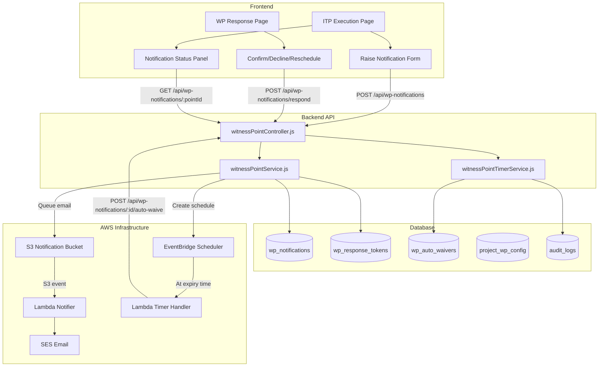

# Design Document: Witness Point Notification & Timer

## Overview

This feature adds a complete witness point notification workflow to the existing ITP execution system. It enables subcontractors to formally notify superintendents of upcoming inspections at witness points, tracks a configurable countdown timer, handles recipient responses (confirm/decline/reschedule), and automatically waives attendance rights when the notice period expires without response.

The design leverages existing infrastructure patterns:
- **Email dispatch**: S3 bucket → Lambda notifier → SES (same as external sign-off and NCR notifications)
- **Token-based responses**: Secure tokens for external recipients (same pattern as `external_sign_off_tokens`)
- **Audit logging**: JSONB metadata in the existing `audit_logs` table
- **Timer mechanism**: EventBridge Scheduler for serverless time-based triggers (no cron needed)

### Key Design Decisions

1. **EventBridge Scheduler for auto-waiver** — Rather than polling or cron, each notification creates a one-shot EventBridge schedule that fires at the expiry time. This is serverless, precise, and cost-effective.
2. **Response tokens reuse the external sign-off pattern** — Crypto-random tokens with expiry, stored in a dedicated table, single-use.
3. **Notification does NOT block sign-off** — Witness points are advisory. The notification workflow runs in parallel to the sign-off workflow and provides information, not enforcement.
4. **Project-level configuration** — Notice period and default recipients are configured per project, stored in a new `project_wp_config` table.

## Architecture



### Timer Mechanism: EventBridge Scheduler

The auto-waiver timer uses AWS EventBridge Scheduler instead of polling or cron:

1. When a notification is created, the service creates a one-shot EventBridge schedule targeting a dedicated Lambda function
2. The schedule fires at `planned_inspection_time - notice_period` (the expiry time)
3. The Lambda invokes the backend's auto-waive endpoint with the notification ID
4. If the notification has already been responded to or cancelled, the auto-waive is a no-op

This approach is:
- **Precise**: Fires at the exact expiry time
- **Serverless**: No always-on infrastructure
- **Cost-effective**: Pay only per schedule creation and invocation
- **Scalable**: Handles thousands of concurrent timers without polling overhead

## Components and Interfaces

### Backend Services

#### `witnessPointService.js`

Primary service handling notification lifecycle.

```javascript
// Core methods
createNotification(pointId, creatorId, { plannedInspectionTime, location, scope, recipientIds, externalRecipients })
cancelNotification(notificationId, userId, reason)
getNotificationByPoint(pointId)
getNotificationById(notificationId)
respondToNotification(notificationId, { responseType, respondentId, token, reason, requestedTime })
respondViaToken(token, { responseType, reason, requestedTime })
getAuditTrail({ instanceId, pointId, status, dateFrom, dateTo })
```

#### `witnessPointTimerService.js`

Handles timer creation, cancellation, and auto-waiver logic.

```javascript
// Core methods
createTimer(notificationId, expiryTime)
cancelTimer(notificationId)
processAutoWaiver(notificationId)
getRemainingTime(notificationId)
```

#### `witnessPointConfigService.js`

Manages project-level configuration.

```javascript
// Core methods
getProjectConfig(projectId)
updateProjectConfig(projectId, { noticePeriodHours, defaultRecipients })
getDefaultRecipients(projectId)
```

#### `witnessPointController.js`

REST controller exposing the API.

```javascript
// Authenticated endpoints
POST   /api/wp-notifications                    // Create notification
GET    /api/wp-notifications/point/:pointId     // Get notification for a point
GET    /api/wp-notifications/:id                // Get notification by ID
POST   /api/wp-notifications/:id/cancel         // Cancel notification
POST   /api/wp-notifications/:id/respond        // Respond (authenticated user)
GET    /api/wp-notifications/:id/remaining-time // Get countdown
GET    /api/wp-notifications/audit              // Query audit trail
POST   /api/wp-notifications/:id/auto-waive    // Internal: triggered by timer Lambda

// Public endpoints (token-based)
GET    /api/wp-notifications/token/:token/validate  // Validate response token
POST   /api/wp-notifications/token/:token/respond   // Respond via token

// Project config
GET    /api/projects/:id/wp-config              // Get WP config
PUT    /api/projects/:id/wp-config              // Update WP config
```

### Frontend Components

#### New Pages

1. **`WitnessPointResponse.tsx`** — Public page for token-based responses (mirrors `ExternalSignOff.tsx` pattern)
   - Validates token on mount
   - Shows notification context (project, ITP, point, planned time)
   - Three response buttons: Confirm Attendance, Decline, Request Reschedule
   - Decline requires reason text
   - Reschedule requires proposed new time

#### Modified Pages

2. **`ITPExecution.tsx`** — Enhanced with notification panel per WP point
   - "Raise Notification" button on WP points (when ITP is Open, no active notification)
   - Notification status badge (Pending/Confirmed/Declined/Expired/Cancelled)
   - Countdown timer display (hours:minutes:seconds, updates every second client-side)
   - Warning banner when notification is pending and sign-off is attempted
   - Waiver indicator when auto-waiver has been triggered

3. **`ProjectDetails.tsx`** — Add WP configuration section
   - Notice period setting (slider or input, 1-168 hours)
   - Default recipients list (add/remove internal users or external emails)

#### New Components

4. **`NotificationPanel.tsx`** — Reusable panel showing notification state for a WP point
5. **`CountdownTimer.tsx`** — Client-side countdown component
6. **`RaiseNotificationModal.tsx`** — Modal form for creating a notification
7. **`WPConfigSection.tsx`** — Project settings section for WP configuration

### Infrastructure

#### New Lambda: Timer Handler

```typescript
// infrastructure/lambda/wp-timer/index.js
// Triggered by EventBridge Scheduler at notification expiry time
// Calls backend auto-waive endpoint with notification ID
```

#### CDK Stack Additions

- EventBridge Scheduler IAM role for creating/deleting schedules
- New Lambda function for timer handling
- Backend Lambda gets `scheduler:CreateSchedule` and `scheduler:DeleteSchedule` permissions
- New S3 lifecycle rule prefix `wp-notification/` with 7-day expiry

## Data Models

### New Tables

#### `wp_notifications`

```sql
CREATE TYPE wp_notification_status AS ENUM ('Pending', 'Confirmed', 'Declined', 'Expired', 'Cancelled');

CREATE TABLE wp_notifications (
    id SERIAL PRIMARY KEY,
    itp_point_id INTEGER NOT NULL REFERENCES itp_points(id) ON DELETE CASCADE,
    itp_instance_id INTEGER NOT NULL REFERENCES itp_instances(id) ON DELETE CASCADE,
    created_by INTEGER NOT NULL REFERENCES users(id),
    status wp_notification_status NOT NULL DEFAULT 'Pending',
    planned_inspection_time TIMESTAMP WITH TIME ZONE NOT NULL,
    notice_period_hours INTEGER NOT NULL DEFAULT 24,
    expiry_time TIMESTAMP WITH TIME ZONE NOT NULL,
    location_description TEXT,
    scope_of_work TEXT,
    scheduler_arn TEXT,  -- EventBridge schedule ARN for cleanup
    responded_by INTEGER REFERENCES users(id),
    responded_at TIMESTAMP WITH TIME ZONE,
    response_reason TEXT,
    requested_reschedule_time TIMESTAMP WITH TIME ZONE,
    cancelled_by INTEGER REFERENCES users(id),
    cancelled_at TIMESTAMP WITH TIME ZONE,
    cancellation_reason TEXT,
    created_at TIMESTAMP WITH TIME ZONE DEFAULT CURRENT_TIMESTAMP,
    updated_at TIMESTAMP WITH TIME ZONE DEFAULT CURRENT_TIMESTAMP
);

-- Only one pending notification per point
CREATE UNIQUE INDEX idx_wp_notifications_pending_point
    ON wp_notifications (itp_point_id)
    WHERE status = 'Pending';
```

#### `wp_notification_recipients`

```sql
CREATE TABLE wp_notification_recipients (
    id SERIAL PRIMARY KEY,
    notification_id INTEGER NOT NULL REFERENCES wp_notifications(id) ON DELETE CASCADE,
    user_id INTEGER REFERENCES users(id),       -- NULL for external recipients
    email VARCHAR(255) NOT NULL,
    recipient_name VARCHAR(255),
    is_external BOOLEAN NOT NULL DEFAULT false,
    notified_at TIMESTAMP WITH TIME ZONE,
    created_at TIMESTAMP WITH TIME ZONE DEFAULT CURRENT_TIMESTAMP
);
```

#### `wp_response_tokens`

```sql
CREATE TABLE wp_response_tokens (
    id SERIAL PRIMARY KEY,
    notification_id INTEGER NOT NULL REFERENCES wp_notifications(id) ON DELETE CASCADE,
    recipient_id INTEGER NOT NULL REFERENCES wp_notification_recipients(id) ON DELETE CASCADE,
    token TEXT UNIQUE NOT NULL,
    expires_at TIMESTAMP WITH TIME ZONE NOT NULL,
    used_at TIMESTAMP WITH TIME ZONE,
    created_at TIMESTAMP WITH TIME ZONE DEFAULT CURRENT_TIMESTAMP
);
```

#### `wp_auto_waivers`

```sql
CREATE TYPE wp_waiver_reason AS ENUM ('timer_expired', 'recipient_declined');

CREATE TABLE wp_auto_waivers (
    id SERIAL PRIMARY KEY,
    notification_id INTEGER NOT NULL REFERENCES wp_notifications(id) ON DELETE CASCADE,
    itp_point_id INTEGER NOT NULL REFERENCES itp_points(id),
    trigger_reason wp_waiver_reason NOT NULL,
    triggered_at TIMESTAMP WITH TIME ZONE DEFAULT CURRENT_TIMESTAMP,
    time_elapsed_hours NUMERIC(6,2),  -- Hours since notification creation
    metadata JSONB
);
```

#### `project_wp_config`

```sql
CREATE TABLE project_wp_config (
    id SERIAL PRIMARY KEY,
    project_id INTEGER NOT NULL REFERENCES projects(id) ON DELETE CASCADE UNIQUE,
    notice_period_hours INTEGER NOT NULL DEFAULT 24 CHECK (notice_period_hours >= 1 AND notice_period_hours <= 168),
    created_at TIMESTAMP WITH TIME ZONE DEFAULT CURRENT_TIMESTAMP,
    updated_at TIMESTAMP WITH TIME ZONE DEFAULT CURRENT_TIMESTAMP
);
```

#### `project_wp_default_recipients`

```sql
CREATE TABLE project_wp_default_recipients (
    id SERIAL PRIMARY KEY,
    project_id INTEGER NOT NULL REFERENCES projects(id) ON DELETE CASCADE,
    user_id INTEGER REFERENCES users(id),       -- NULL for external
    email VARCHAR(255) NOT NULL,
    recipient_name VARCHAR(255),
    is_external BOOLEAN NOT NULL DEFAULT false,
    role_filter INTEGER REFERENCES roles(id),   -- Optional: auto-include users with this role
    created_at TIMESTAMP WITH TIME ZONE DEFAULT CURRENT_TIMESTAMP
);
```

### Schema Modifications

#### `itp_points` — Add waiver metadata column

```sql
ALTER TABLE itp_points ADD COLUMN wp_waiver_status JSONB;
-- Example value: {"waived": true, "reason": "timer_expired", "waived_at": "2024-01-15T10:00:00Z"}
```

### Migration File

All schema changes go in `backend/database/migrations/005_witness_point_notifications.sql`.

## Correctness Properties

*A property is a characteristic or behavior that should hold true across all valid executions of a system — essentially, a formal statement about what the system should do. Properties serve as the bridge between human-readable specifications and machine-verifiable correctness guarantees.*

### Property 1: Notification creation produces a valid record

*For any* valid witness point (type 'WP') in an open ITP instance, and any planned inspection time that satisfies the notice period constraint, creating a notification SHALL produce a record with status 'Pending', the correct ITP point reference, planned inspection time, location, scope, and a non-null creation timestamp.

**Validates: Requirements 1.1, 1.4**

### Property 2: Time validation enforces notice period

*For any* planned inspection time and configured notice period, the notification service SHALL accept creation if and only if `planned_inspection_time >= current_time + notice_period_hours`. Times that violate this constraint SHALL be rejected.

**Validates: Requirements 1.2, 1.3**

### Property 3: Duplicate prevention

*For any* ITP point of type 'WP', at most one notification with status 'Pending' SHALL exist at any time. Attempting to create a second notification while one is pending SHALL be rejected.

**Validates: Requirements 1.6**

### Property 4: ITP status precondition

*For any* ITP instance with status other than 'Open', attempting to create a witness point notification SHALL be rejected. Only instances with status 'Open' SHALL allow notification creation.

**Validates: Requirements 1.7**

### Property 5: Expiry time calculation

*For any* notification with a planned inspection time `T` and notice period `N` hours, the stored expiry time SHALL equal `T - N hours`. This relationship SHALL be maintained after any update to the planned inspection time.

**Validates: Requirements 2.1, 2.5**

### Property 6: Remaining time calculation

*For any* pending notification with planned inspection time `T` and current time `now` where `now < T`, the remaining time SHALL equal `T - now` decomposed into hours, minutes, and seconds with no negative values.

**Validates: Requirements 2.2**

### Property 7: Notice period configuration validation

*For any* notice period configuration value, the system SHALL accept it if and only if it is an integer in the range [1, 168]. When no configuration exists for a project, the effective notice period SHALL be 24 hours.

**Validates: Requirements 2.3**

### Property 8: Response token uniqueness

*For any* set of notification dispatches, each generated response token SHALL be unique across all tokens in the system. No two tokens SHALL have the same value.

**Validates: Requirements 3.1**

### Property 9: Response state machine

*For any* pending notification with a valid response token:
- A 'confirm' response SHALL transition status to 'Confirmed' and record respondent identity and timestamp
- A 'decline' response SHALL transition status to 'Declined', record the decline reason, and trigger auto-waiver
- A 'reschedule' response SHALL keep status as 'Pending' and record the requested new time

**Validates: Requirements 3.2, 3.3, 3.4**

### Property 10: Token validity constraints

*For any* response token, it SHALL be rejected if: (a) the current time exceeds the planned inspection time, OR (b) the token has already been used for a previous response. Valid tokens are single-use and time-bounded.

**Validates: Requirements 3.5, 3.6**

### Property 11: Auto-waiver on expiry

*For any* notification with status 'Pending' where the current time has reached or exceeded the expiry time and no response has been recorded, the auto-waiver process SHALL transition the status to 'Expired' and create a waiver record with reason 'timer_expired'.

**Validates: Requirements 2.4, 4.1**

### Property 12: Auto-waiver on decline

*For any* notification where a recipient explicitly declines, the auto-waiver process SHALL be triggered immediately regardless of remaining time, creating a waiver record with reason 'recipient_declined'.

**Validates: Requirements 4.4**

### Property 13: Waiver record completeness

*For any* auto-waiver event, the waiver record SHALL contain the trigger reason (either 'timer_expired' or 'recipient_declined'), and the associated ITP point's `wp_waiver_status` metadata SHALL be updated to indicate the point may proceed without superintendent attendance.

**Validates: Requirements 4.5, 4.6**

### Property 14: Cancellation state machine

*For any* notification, cancellation SHALL succeed if and only if the current status is 'Pending'. Successful cancellation SHALL transition status to 'Cancelled' with reason and timestamp recorded. Cancellation of non-pending notifications SHALL be rejected.

**Validates: Requirements 5.1, 5.3**

### Property 15: Audit trail completeness

*For any* notification status transition (creation, response, waiver, cancellation), an audit log entry SHALL be created containing: notification ID, ITP point ID, ITP instance ID, previous status, new status, acting user/system identifier, timestamp, and response content (if applicable).

**Validates: Requirements 6.1, 6.3, 6.4**

### Property 16: Audit trail filtering

*For any* set of audit log entries and any combination of filters (ITP instance, ITP point, notification status, date range), the API SHALL return exactly those entries matching all specified filter criteria.

**Validates: Requirements 6.6**

### Property 17: Recipient defaults with override

*For any* project with configured default recipients, creating a notification SHALL pre-populate the recipient list from defaults. The final recipient list SHALL equal (defaults + additions - removals) as specified by the creator.

**Validates: Requirements 7.2**

### Property 18: External recipients get response tokens

*For any* notification recipient marked as external (no application account), the system SHALL generate a response token for that recipient. Internal recipients SHALL NOT require a token for response.

**Validates: Requirements 7.4**

### Property 19: Sign-off not blocked by notification status

*For any* witness point and any notification status (Pending, Confirmed, Declined, Expired, Cancelled, or no notification), the sign-off operation SHALL succeed. Notification status SHALL never prevent sign-off.

**Validates: Requirements 8.3**

### Property 20: Sign-off audit includes notification status

*For any* witness point sign-off where a notification exists, the sign-off audit log entry's metadata SHALL include the notification status at the time of sign-off.

**Validates: Requirements 8.4**

## Error Handling

### Validation Errors (400)

| Scenario | Error Message |
|----------|--------------|
| Planned time < now + notice period | `Planned inspection time must be at least {N} hours in the future` |
| Point type is not 'WP' | `Notifications can only be raised for Witness Points (WP)` |
| ITP not Open | `ITP must be in Open status to raise notifications` |
| Duplicate pending notification | `A pending notification already exists for this witness point` |
| Cancel non-pending | `Only pending notifications can be cancelled` |
| Response after expiry | `This notification has expired. Response is no longer accepted` |
| Token already used | `This response link has already been used` |
| Notice period out of range | `Notice period must be between 1 and 168 hours` |

### Authorization Errors (403)

| Scenario | Error Message |
|----------|--------------|
| Non-SC/HC creating notification | `Only Subcontractors and Head Contractors can raise notifications` |
| Non-creator cancelling | `Only the notification creator can cancel a notification` |
| Non-HC/Admin updating config | `Only Head Contractors and Admins can configure notification settings` |

### Not Found Errors (404)

| Scenario | Error Message |
|----------|--------------|
| Invalid notification ID | `Notification not found` |
| Invalid token | `Invalid or expired response link` |
| Point not found | `ITP point not found` |

### System Errors

- **EventBridge schedule creation failure**: Log error, set `scheduler_arn` to NULL, fall back to a periodic sweep Lambda that checks for expired notifications every 5 minutes
- **Email dispatch failure**: Log to audit trail with 'email_failed' event, do not block notification creation
- **Database transaction failure**: Full rollback, return 500 with generic message

### Fallback Timer Mechanism

If EventBridge schedule creation fails, a fallback sweep Lambda runs every 5 minutes:
```sql
SELECT id FROM wp_notifications
WHERE status = 'Pending'
  AND expiry_time <= NOW()
  AND scheduler_arn IS NULL;
```
This ensures no notification is permanently stuck in 'Pending' state.

## Testing Strategy

### Property-Based Tests (fast-check)

The feature is well-suited for property-based testing because it has:
- Pure validation logic (time constraints, status preconditions)
- State machine transitions with clear rules
- Arithmetic calculations (expiry time, remaining time)
- Uniqueness constraints

**Library**: `fast-check` (already in devDependencies)
**Minimum iterations**: 100 per property test
**Tag format**: `Feature: witness-point-notification, Property {N}: {title}`

Property tests will cover:
- Time validation logic (Property 2)
- Expiry time calculation (Property 5)
- Remaining time calculation (Property 6)
- Notice period config validation (Property 7)
- Response state machine transitions (Property 9)
- Token validity constraints (Property 10)
- Auto-waiver trigger logic (Properties 11, 12)
- Cancellation state machine (Property 14)
- Sign-off non-blocking invariant (Property 19)

### Unit Tests (Jest)

Unit tests will cover specific examples and edge cases:
- Notification creation with all field combinations
- Token generation uniqueness (example with 1000 tokens)
- Audit log entry structure verification
- Email payload format validation
- Recipient default population with overrides
- EventBridge schedule payload format

### Integration Tests

Integration tests will verify:
- Full notification → response → waiver flow end-to-end
- S3 email payload written correctly (mocked S3)
- Database transaction rollback on failure
- EventBridge schedule creation (mocked SDK)
- Concurrent notification creation (duplicate prevention under race conditions)

### Test File Structure

```
backend/tests/unit/
  witnessPointService.test.js        # Service logic + property tests
  witnessPointTimerService.test.js   # Timer logic + property tests
  witnessPointController.test.js     # Controller validation
  witnessPointConfig.test.js         # Config validation property tests
```
