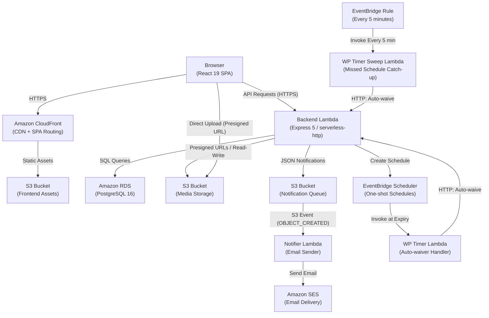
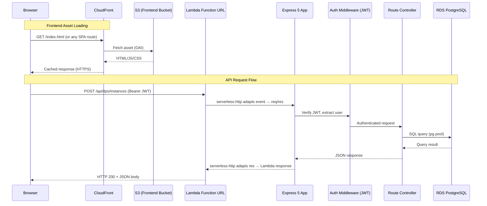
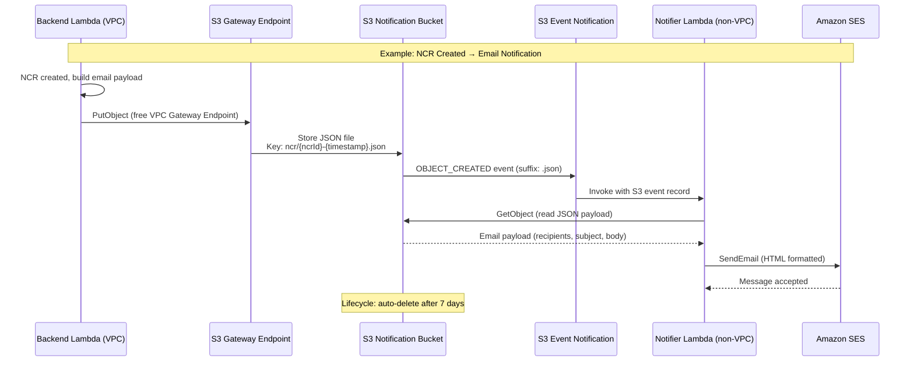
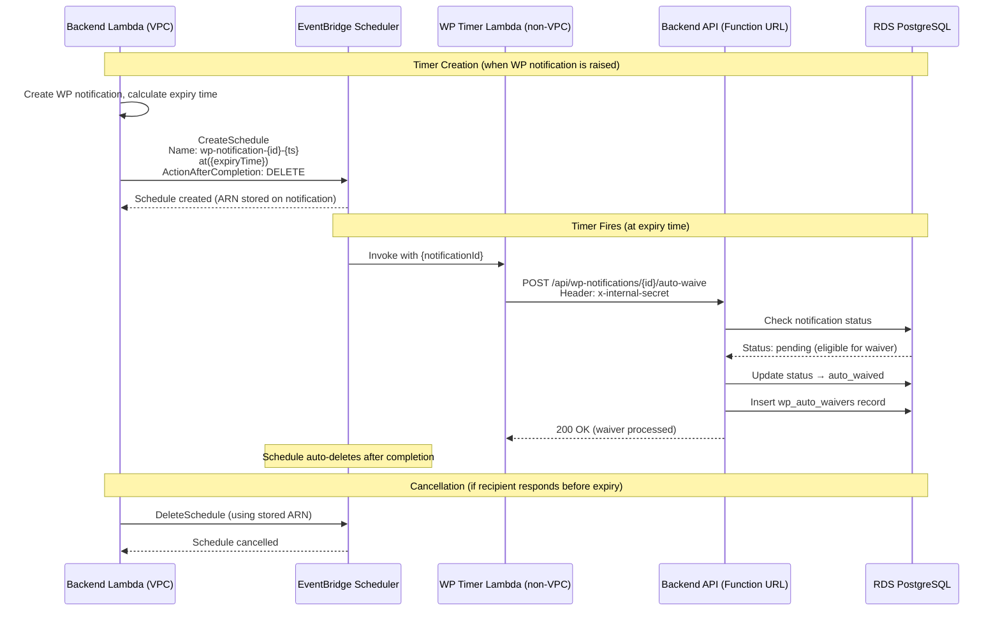
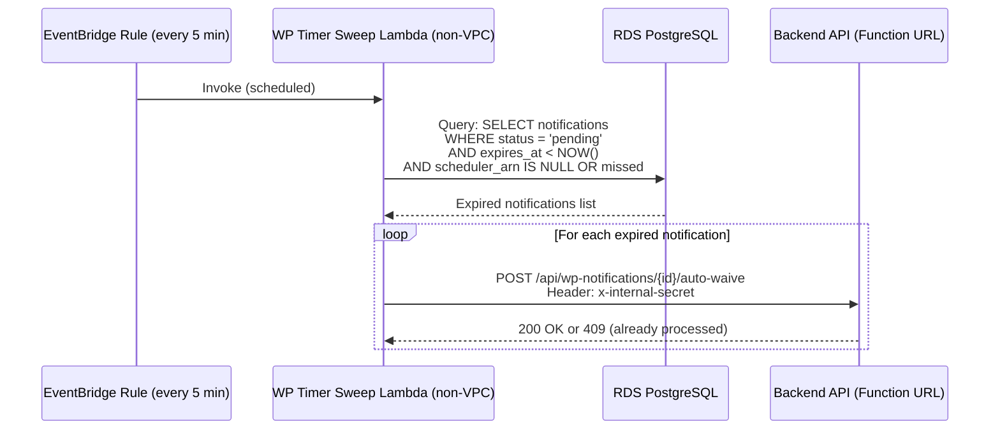
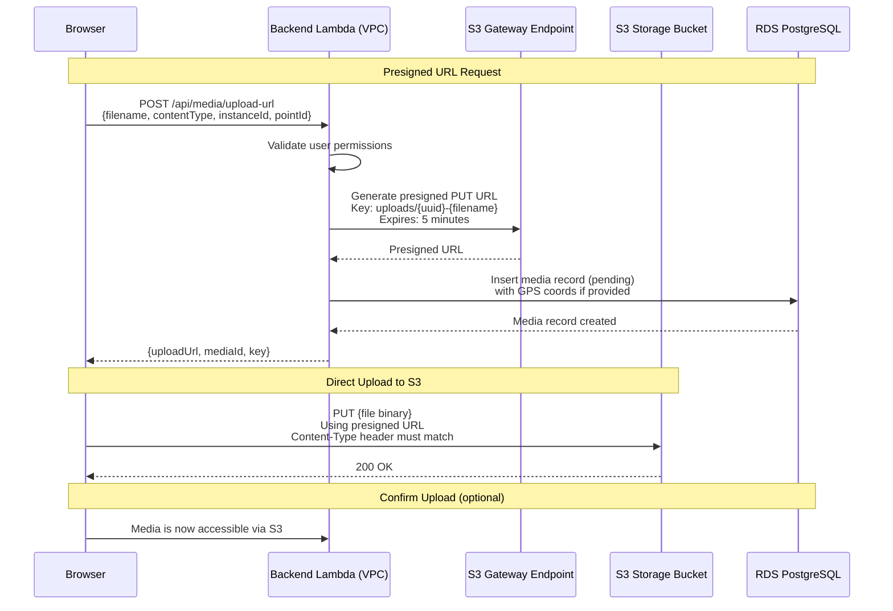
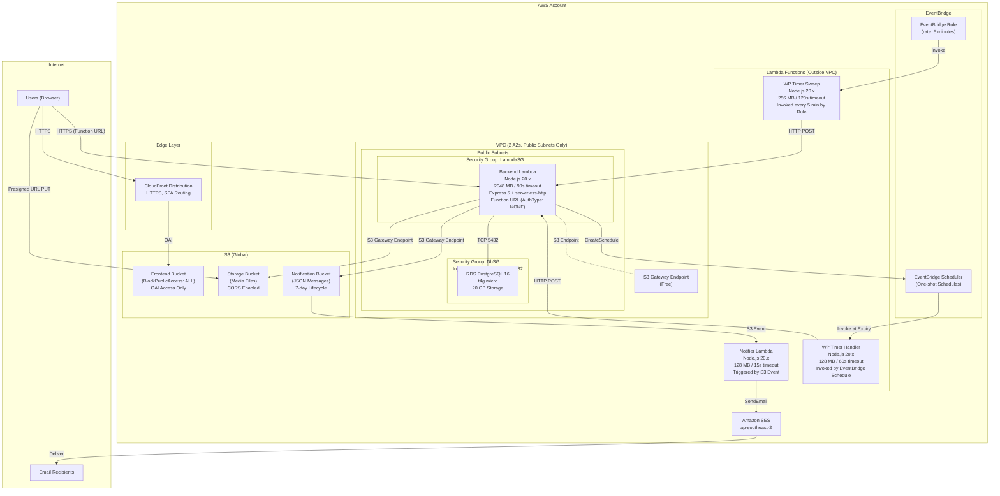

# Architecture Overview

<!--
  Last Updated: 2025-01-20
  Covers: v1.0 of the application
  Maintainer: Development Team
-->

This document describes the system architecture of the Construction Quality Management application, including component interactions, data flows, and deployment topology.

For detailed rationale behind each architectural decision, see the [Architecture Decision Records](./adr/README.md).

---

## Table of Contents

- [System Context](#system-context)
- [Request Flow](#request-flow)
- [Notification Flow](#notification-flow)
- [Witness Point Timer Flow](#witness-point-timer-flow)
- [Media Upload Flow](#media-upload-flow)
- [Deployment Architecture](#deployment-architecture)

---

## System Context

The system consists of a React SPA frontend served via CloudFront, a serverless Express backend on Lambda, a PostgreSQL database on RDS, and several supporting AWS services for notifications, scheduling, and file storage.

### Key Components

| Component | Technology | Purpose |
|-----------|-----------|---------|
| Frontend | React 19 SPA on CloudFront + S3 | User interface for all roles |
| Backend | Express 5 on Lambda (serverless-http) | REST API (60+ endpoints) |
| Database | PostgreSQL 16 on RDS (t4g.micro) | Persistent data storage |
| Media Storage | S3 Bucket | Photos, attachments, logos |
| Notification Bucket | S3 Bucket | Async message bridge (VPC → non-VPC) |
| Notifier Lambda | Node.js 20.x Lambda | Sends emails via SES |
| WP Timer Lambda | Node.js 20.x Lambda | Processes auto-waivers at expiry |
| WP Timer Sweep | Node.js 20.x Lambda | Catches missed schedules every 5 min |
| EventBridge Scheduler | AWS EventBridge | One-shot schedules for WP expiry |
| SES | Amazon Simple Email Service | Transactional email delivery |
| CloudFront | Amazon CloudFront | CDN, HTTPS enforcement, SPA routing |

---

## Request Flow

All API requests from the browser go directly to the backend Lambda Function URL. The frontend SPA is served separately via CloudFront. This separation means the API is not behind CloudFront or API Gateway.

### Key Details

- **Lambda Function URL** exposes the backend directly (no API Gateway). This eliminates the 30-second API Gateway timeout and reduces cost. Auth type is `NONE` — authentication is handled by the Express JWT middleware.
- **serverless-http** (v4) wraps the Express app, translating Lambda events into standard `req`/`res` objects. Binary content types (PDF, images) are explicitly configured.
- **CORS** is configured on the Function URL to allow requests from the CloudFront distribution domain.
- **Cold starts** are ~1-2 seconds due to the 2048 MB memory allocation. This is acceptable for construction QA workflows which are not latency-sensitive.
- **CloudFront SPA routing** uses custom error responses: 403/404 errors return `/index.html` with status 200, allowing React Router to handle client-side routing.

See [ADR-001: Express on Lambda](./adr/001-serverless-express.md) and [ADR-008: CloudFront + S3 SPA](./adr/008-cloudfront-s3-spa.md) for detailed rationale.

---

## Notification Flow

The backend Lambda runs inside a VPC (for RDS access) but needs to send emails. Since SES has no VPC endpoint and a NAT Gateway costs ~$32/month, we use S3 as an asynchronous message bridge. The S3 Gateway Endpoint is free and accessible from within the VPC.

### Notification Types

The notification bucket uses key prefixes to categorize different notification types:

| Prefix | Purpose | Triggered By |
|--------|---------|-------------|
| `ncr/` | NCR creation/update notifications | NCR controller |
| `email/` | User onboarding emails (invitations, password resets) | Auth/invitation controllers |
| `wp-notification/` | Witness point notification and waiver emails | WP notification service |

### Design Properties

- **Non-blocking**: API responses are never delayed by email delivery. The `PutObject` call returns immediately.
- **Retry built-in**: S3 event notifications have automatic retry with DLQ support.
- **Audit trail**: Notification payloads are preserved for 7 days before lifecycle deletion.
- **Zero additional cost**: S3 Gateway Endpoint is free; storage for small JSON files is negligible.
- **Decoupled**: The notifier Lambda has no dependency on the backend code or VPC.

See [ADR-002: S3 Notification Pattern](./adr/002-s3-notification-pattern.md) for detailed rationale.

---

## Witness Point Timer Flow

Witness points have a defined notice period. If no recipient responds before the planned inspection time, the witness point is automatically waived so the contractor can proceed. This requires a reliable timer that fires at a specific future time for each individual notification.

### Sweep Lambda (Reliability Fallback)

A sweep Lambda runs every 5 minutes via an EventBridge Rule to catch any missed expirations (e.g., if schedule creation failed or the one-shot schedule didn't fire).

### Key Design Properties

- **Precise timing**: Schedules fire at the exact expiry time (within a 5-minute flexible window).
- **Auto-cleanup**: `ActionAfterCompletion: DELETE` removes the schedule after firing.
- **Idempotent**: The auto-waive endpoint checks notification status before acting — duplicate invocations are safe.
- **Graceful degradation**: If schedule creation fails, `scheduler_arn` is set to NULL and the sweep Lambda catches it within 5 minutes.
- **Internal authentication**: Timer Lambdas authenticate to the backend API using a shared `x-internal-secret` header, not JWT.

See [ADR-003: EventBridge Auto-Waivers](./adr/003-eventbridge-auto-waivers.md) for detailed rationale.

---

## Media Upload Flow

Media files (photos, attachments) are uploaded directly to S3 using presigned URLs. The backend never proxies file content — it only generates the presigned URL and stores metadata in the database.

### Key Design Properties

- **No proxy overhead**: Files go directly from browser to S3, avoiding Lambda's 6 MB payload limit and reducing latency.
- **Presigned URL security**: URLs expire after 5 minutes and are scoped to a specific key and content type.
- **GPS metadata**: Upload requests can include latitude/longitude coordinates captured from the device.
- **S3 Gateway Endpoint**: The backend generates presigned URLs via the free S3 Gateway Endpoint from within the VPC.
- **CORS configured**: The storage bucket allows PUT from any origin to support direct browser uploads.

---

## Deployment Architecture

The application is deployed as a single CloudFormation stack via AWS CDK. The VPC uses public subnets only (no NAT Gateway) to minimize cost.

### Lambda Functions Summary

| Function | Location | Runtime | Memory | Timeout | Trigger |
|----------|----------|---------|--------|---------|---------|
| **Backend** (ItpBackend) | VPC (Public Subnets) | Node.js 20.x | 2048 MB | 90s | Function URL (HTTP) |
| **Notifier** (NcrNotifier) | Outside VPC | Node.js 20.x | 128 MB | 15s | S3 Event (OBJECT_CREATED, .json) |
| **WP Timer Handler** (WpTimerHandler) | Outside VPC | Node.js 20.x | 128 MB | 60s | EventBridge Schedule (one-shot) |
| **WP Timer Sweep** (WpTimerSweep) | Outside VPC | Node.js 20.x | 256 MB | 120s | EventBridge Rule (every 5 min) |

### Security Groups

| Security Group | Rules | Purpose |
|---------------|-------|---------|
| **LambdaSG** | Outbound: All (default) | Attached to backend Lambda |
| **DbSG** | Ingress: LambdaSG → TCP 5432 | Attached to RDS instance. Only the backend Lambda can connect. |

### VPC Configuration

- **2 Availability Zones** for RDS multi-AZ readiness
- **Public subnets only** — no private subnets, no NAT Gateway ($0/month for NAT)
- **S3 Gateway Endpoint** — free endpoint allowing VPC resources to access S3 without internet
- **No internet gateway egress needed** for S3 access (Gateway Endpoint handles it)
- Backend Lambda uses `allowPublicSubnet: true` to deploy in public subnets

### IAM Roles and Permissions

| Principal | Permissions | Purpose |
|-----------|------------|---------|
| Backend Lambda | S3 ReadWrite (storage), S3 Write (notifications), SES Send, Scheduler Create/Delete/Get, IAM PassRole | Full API operations |
| Notifier Lambda | S3 Read (notifications), SES Send | Read notification JSON, send email |
| WP Timer Handler | None (uses HTTP) | Calls backend API via Function URL |
| WP Timer Sweep | None (uses HTTP + direct DB) | Queries DB, calls backend API |
| EventBridge Scheduler Role | Lambda InvokeFunction (WP Timer) | Scheduler invokes timer Lambda |

### Cost Optimization

- **No NAT Gateway** — saves ~$32/month by using S3 Gateway Endpoint and non-VPC Lambdas for internet access
- **No API Gateway** — Lambda Function URL is free (no per-request charges beyond Lambda invocation)
- **t4g.micro RDS** — ARM-based instance for lowest cost
- **S3 Gateway Endpoint** — free data transfer between VPC and S3
- **EventBridge Scheduler** — free tier covers 14M invocations/month
- **CloudFront** — free tier covers 1 TB/month transfer

---

[← Back to Documentation Index](./README.md)
