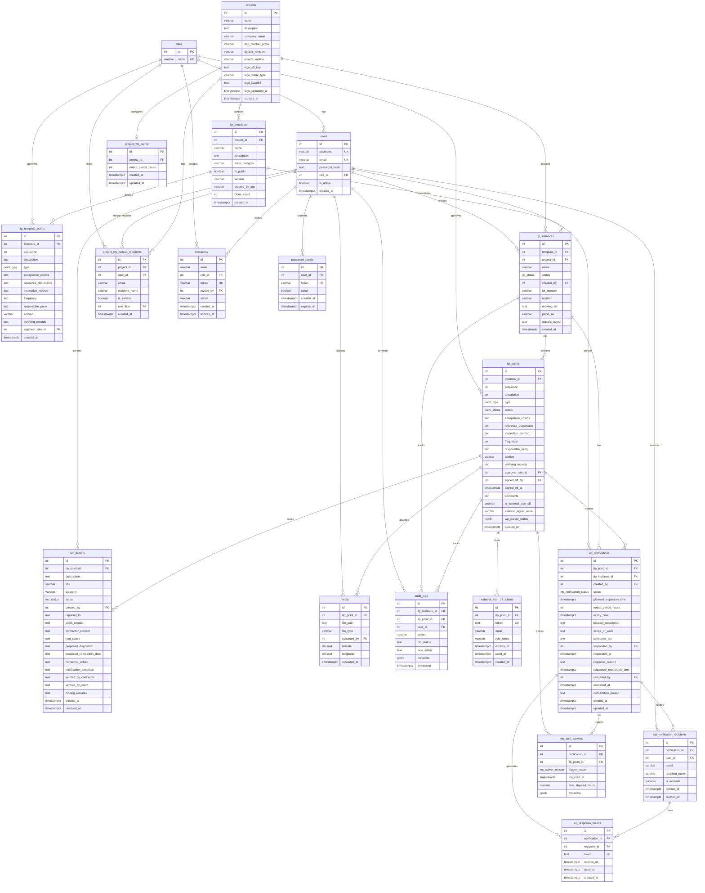

# Database Schema Documentation

<!-- 
  Last Updated: 2025-01-01
  Covers: v1.0 of the application
  Maintainer: Development Team
-->

## Overview

The Construction Quality Management application uses PostgreSQL as its primary data store. The schema is organized into the following domains:

| Domain | Tables | Purpose |
|--------|--------|---------|
| Core | roles, users, projects, audit_logs | Authentication, authorization, and audit trail |
| ITP | itp_templates, itp_template_points, itp_instances, itp_points | Inspection and Test Plan management |
| NCR | ncr_defects | Non-Conformance Report tracking |
| Media | media | File attachments with GPS coordinates |
| External Sign-Off | external_sign_off_tokens | Token-based external approvals |
| Witness Points | wp_notifications, wp_notification_recipients, wp_response_tokens, wp_auto_waivers, project_wp_config, project_wp_default_recipients | Witness point notification workflow |
| User Onboarding | invitations, password_resets | Invitation and password reset flows |

## Custom Enum Types

### point_type

Defines the inspection point classification.

| Value | Description |
|-------|-------------|
| `HP` | Hold Point — blocks progress until approved by designated role |
| `WP` | Witness Point — requires notification to stakeholders before inspection |
| `RP` | Review Point — requires document review |
| `SP` | Sample Point — requires physical sample collection |
| `IP` | Inspection Point — standard inspection checkpoint |

### itp_status

Tracks the lifecycle state of an ITP instance.

| Value | Description |
|-------|-------------|
| `Draft` | Initial state, ITP is being prepared |
| `Open` | ITP is active and points can be signed off |
| `Pending Review` | All points approved, awaiting final review |
| `Approved` | ITP has been approved by reviewer |
| `Rejected` | ITP was rejected, needs rework |
| `Closed` | ITP is complete and archived |
| `Overdue` | ITP has exceeded its expected completion date |

### point_status

Tracks the sign-off state of individual ITP points.

| Value | Description |
|-------|-------------|
| `Open` | Point has not been inspected yet |
| `Pending` | Point is awaiting approval |
| `Approved` | Point has been signed off |
| `Rejected` | Point was rejected, needs rework |
| `Closed` | Point is finalized |

### ncr_status

Tracks the lifecycle of a Non-Conformance Report.

| Value | Description |
|-------|-------------|
| `Open` | NCR has been raised and is active |
| `Resolved` | Corrective action has been completed |
| `Verified` | Resolution has been verified |
| `Closed` | NCR is complete and archived |

### wp_notification_status

Tracks the state of a witness point notification.

| Value | Description |
|-------|-------------|
| `Pending` | Notification sent, awaiting response |
| `Confirmed` | Recipient confirmed attendance |
| `Declined` | Recipient declined attendance |
| `Expired` | Notice period elapsed without response |
| `Cancelled` | Notification was cancelled by creator |

### wp_waiver_reason

Records why a witness point was auto-waived.

| Value | Description |
|-------|-------------|
| `timer_expired` | The notice period elapsed without a response |
| `recipient_declined` | The recipient explicitly declined attendance |

---

## Core Tables

### roles

Stores the four application roles used for RBAC.

| Column | Type | Constraints | Description |
|--------|------|-------------|-------------|
| id | SERIAL | PRIMARY KEY | Auto-incrementing role identifier |
| name | VARCHAR(50) | UNIQUE, NOT NULL | Role name (Subcontractor, Head Contractor, Client, Admin) |

**Seed Data:** Subcontractor, Head Contractor, Client, Admin

---

### users

Stores registered user accounts.

| Column | Type | Constraints | Description |
|--------|------|-------------|-------------|
| id | SERIAL | PRIMARY KEY | Auto-incrementing user identifier |
| username | VARCHAR(100) | UNIQUE, NOT NULL | Display name |
| email | VARCHAR(255) | UNIQUE, NOT NULL | Login email address |
| password_hash | TEXT | NOT NULL | bcrypt-hashed password |
| role_id | INTEGER | FK → roles(id) | Assigned role |
| is_active | BOOLEAN | NOT NULL, DEFAULT true | Whether the user can log in (added in migration 001) |
| created_at | TIMESTAMPTZ | DEFAULT CURRENT_TIMESTAMP | Account creation time |

**Foreign Keys:**
- `role_id` → `roles(id)`

---

### projects

Stores project records that group ITP instances.

| Column | Type | Constraints | Description |
|--------|------|-------------|-------------|
| id | SERIAL | PRIMARY KEY | Auto-incrementing project identifier |
| name | VARCHAR(255) | NOT NULL | Project name |
| description | TEXT | — | Project description |
| company_name | VARCHAR(255) | — | Company name for report branding (migration 007) |
| doc_number_prefix | VARCHAR(50) | — | Document number prefix for reports (migration 007) |
| default_revision | VARCHAR(20) | DEFAULT 'Rev 0' | Default revision label (migration 007) |
| project_subtitle | VARCHAR(500) | — | Subtitle for report cover pages (migration 007) |
| logo_s3_key | TEXT | — | S3 object key for uploaded logo (migration 007) |
| logo_mime_type | VARCHAR(50) | — | MIME type of uploaded logo (migration 007) |
| logo_base64 | TEXT | — | Base64-encoded logo for PDF embedding (migration 007) |
| logo_uploaded_at | TIMESTAMPTZ | — | When the logo was uploaded (migration 007) |
| created_at | TIMESTAMPTZ | DEFAULT CURRENT_TIMESTAMP | Project creation time |

---

### audit_logs

Records all significant actions for traceability.

| Column | Type | Constraints | Description |
|--------|------|-------------|-------------|
| id | SERIAL | PRIMARY KEY | Auto-incrementing log identifier |
| itp_instance_id | INTEGER | FK → itp_instances(id) | Related ITP instance |
| itp_point_id | INTEGER | FK → itp_points(id) | Related ITP point |
| user_id | INTEGER | FK → users(id) | User who performed the action |
| action | VARCHAR(100) | NOT NULL | Action description (e.g., 'sign_off', 'status_change') |
| old_status | TEXT | — | Previous status value |
| new_status | TEXT | — | New status value |
| metadata | JSONB | — | Additional structured data about the action |
| timestamp | TIMESTAMPTZ | DEFAULT CURRENT_TIMESTAMP | When the action occurred |

**Foreign Keys:**
- `itp_instance_id` → `itp_instances(id)`
- `itp_point_id` → `itp_points(id)`
- `user_id` → `users(id)`

**Indexes:**
- `idx_audit_logs_itp_point_id` on `itp_point_id` (migration 006)

---

## ITP Tables

### itp_templates

Stores reusable ITP templates that can be instantiated for specific projects.

| Column | Type | Constraints | Description |
|--------|------|-------------|-------------|
| id | SERIAL | PRIMARY KEY | Auto-incrementing template identifier |
| project_id | INTEGER | FK → projects(id) | Owning project (NULL for global library templates) |
| name | VARCHAR(255) | NOT NULL | Template name |
| description | TEXT | — | Template description |
| trade_category | VARCHAR(100) | — | Trade/discipline category (migration 002) |
| is_public | BOOLEAN | DEFAULT false | Whether template is in the global library (migration 002) |
| version | VARCHAR(20) | DEFAULT '1.0' | Template version string (migration 002) |
| created_by_org | VARCHAR(255) | — | Organization that created the template (migration 002) |
| clone_count | INTEGER | DEFAULT 0 | Number of times this template has been cloned (migration 002) |
| created_at | TIMESTAMPTZ | DEFAULT CURRENT_TIMESTAMP | Template creation time |

**Foreign Keys:**
- `project_id` → `projects(id)`

---

### itp_template_points

Defines the inspection points within a template.

| Column | Type | Constraints | Description |
|--------|------|-------------|-------------|
| id | SERIAL | PRIMARY KEY | Auto-incrementing point identifier |
| template_id | INTEGER | FK → itp_templates(id) ON DELETE CASCADE | Parent template |
| sequence | INTEGER | NOT NULL | Display order within the template |
| description | TEXT | NOT NULL | What is being inspected |
| type | point_type | NOT NULL | Point classification (HP, WP, RP, SP, IP) |
| acceptance_criteria | TEXT | — | Criteria for passing inspection |
| reference_documents | TEXT | — | Related standards or drawings |
| inspection_method | TEXT | — | How the inspection is performed |
| frequency | TEXT | — | How often inspection occurs |
| responsible_party | TEXT | — | Who performs the inspection |
| section | VARCHAR(255) | — | Section grouping within the template |
| verifying_records | TEXT | — | Required verification documentation |
| approver_role_id | INTEGER | FK → roles(id) | Role required to approve this point |
| created_at | TIMESTAMPTZ | DEFAULT CURRENT_TIMESTAMP | Point creation time |

**Foreign Keys:**
- `template_id` → `itp_templates(id)` (CASCADE on delete)
- `approver_role_id` → `roles(id)`

---

### itp_instances

Represents an active ITP execution for a specific project/lot.

| Column | Type | Constraints | Description |
|--------|------|-------------|-------------|
| id | SERIAL | PRIMARY KEY | Auto-incrementing instance identifier |
| template_id | INTEGER | FK → itp_templates(id) | Source template |
| project_id | INTEGER | FK → projects(id) | Owning project |
| name | VARCHAR(255) | NOT NULL | Instance name |
| status | itp_status | DEFAULT 'Draft' | Current lifecycle state |
| created_by | INTEGER | FK → users(id) | User who created the instance |
| lot_number | VARCHAR(100) | — | Construction lot reference |
| revision | VARCHAR(10) | — | Document revision number |
| drawing_ref | TEXT | — | Related drawing reference |
| panel_no | VARCHAR(100) | — | Panel or element number |
| closure_notes | TEXT | — | Notes added at closure |
| created_at | TIMESTAMPTZ | DEFAULT CURRENT_TIMESTAMP | Instance creation time |

**Foreign Keys:**
- `template_id` → `itp_templates(id)`
- `project_id` → `projects(id)`
- `created_by` → `users(id)`

---

### itp_points

Individual inspection points within an ITP instance execution.

| Column | Type | Constraints | Description |
|--------|------|-------------|-------------|
| id | SERIAL | PRIMARY KEY | Auto-incrementing point identifier |
| instance_id | INTEGER | FK → itp_instances(id) ON DELETE CASCADE | Parent ITP instance |
| sequence | INTEGER | NOT NULL | Display order within the instance |
| description | TEXT | NOT NULL | What is being inspected |
| type | point_type | NOT NULL | Point classification (HP, WP, RP, SP, IP) |
| status | point_status | DEFAULT 'Open' | Current sign-off state |
| acceptance_criteria | TEXT | — | Criteria for passing inspection |
| reference_documents | TEXT | — | Related standards or drawings |
| inspection_method | TEXT | — | How the inspection is performed |
| frequency | TEXT | — | How often inspection occurs |
| responsible_party | TEXT | — | Who performs the inspection |
| section | VARCHAR(255) | — | Section grouping |
| verifying_records | TEXT | — | Required verification documentation |
| approver_role_id | INTEGER | FK → roles(id) | Role required to approve this point |
| signed_off_by | INTEGER | FK → users(id) | User who signed off |
| signed_off_at | TIMESTAMPTZ | — | When sign-off occurred |
| comments | TEXT | — | Sign-off comments |
| is_external_sign_off | BOOLEAN | DEFAULT false | Whether signed off by external party (migration 003) |
| external_signer_email | VARCHAR(255) | — | Email of external signer (migration 003) |
| wp_waiver_status | JSONB | — | Witness point waiver metadata (migration 005) |
| created_at | TIMESTAMPTZ | DEFAULT CURRENT_TIMESTAMP | Point creation time |

**Foreign Keys:**
- `instance_id` → `itp_instances(id)` (CASCADE on delete)
- `approver_role_id` → `roles(id)`
- `signed_off_by` → `users(id)`

**Indexes:**
- `idx_itp_points_instance_id` on `instance_id` (migration 006)

---

## NCR Table

### ncr_defects

Stores Non-Conformance Reports raised against ITP inspection points.

| Column | Type | Constraints | Description |
|--------|------|-------------|-------------|
| id | SERIAL | PRIMARY KEY | Auto-incrementing NCR identifier |
| itp_point_id | INTEGER | FK → itp_points(id) | The ITP point this NCR is raised against |
| description | TEXT | NOT NULL | Detailed description of the non-conformance |
| title | VARCHAR(255) | — | Short title for the NCR |
| category | VARCHAR(100) | — | Defect category (e.g., structural, finish) |
| status | ncr_status | DEFAULT 'Open' | Current lifecycle state |
| created_by | INTEGER | FK → users(id) | User who raised the NCR |
| reported_to | TEXT | — | Person/organization the NCR is reported to |
| client_contact | TEXT | — | Client contact for this NCR |
| contractor_contact | TEXT | — | Contractor contact for this NCR |
| root_cause | TEXT | — | Identified root cause of the defect |
| proposed_disposition | TEXT | — | Proposed method of resolution |
| proposed_completion_date | TEXT | — | Target date for corrective action |
| corrective_action | TEXT | — | Description of corrective action taken |
| rectification_complete | TEXT | — | Confirmation of rectification completion |
| verified_by_contractor | TEXT | — | Contractor verification details |
| verified_by_client | TEXT | — | Client verification details |
| closing_remarks | TEXT | — | Final remarks at NCR closure |
| created_at | TIMESTAMPTZ | DEFAULT CURRENT_TIMESTAMP | When the NCR was raised |
| resolved_at | TIMESTAMPTZ | — | When the NCR was resolved |

**Foreign Keys:**
- `itp_point_id` → `itp_points(id)` — Links the NCR to a specific inspection point
- `created_by` → `users(id)`

**Indexes:**
- `idx_ncr_defects_itp_point_id` on `itp_point_id` (migration 006)

**Business Rules:**
- An open NCR blocks approval of its associated ITP point
- NCRs follow the lifecycle: Open → Resolved → Verified → Closed

---

## Media Table

### media

Stores file attachment metadata for evidence photos and documents linked to ITP points.

| Column | Type | Constraints | Description |
|--------|------|-------------|-------------|
| id | SERIAL | PRIMARY KEY | Auto-incrementing media identifier |
| itp_point_id | INTEGER | FK → itp_points(id) ON DELETE CASCADE | Associated ITP point |
| file_path | TEXT | NOT NULL | S3 key or file path to the stored file |
| file_type | VARCHAR(50) | — | MIME type of the file (e.g., image/jpeg) |
| uploaded_by | INTEGER | FK → users(id) | User who uploaded the file |
| latitude | DECIMAL(9,6) | — | GPS latitude coordinate (migration 004) |
| longitude | DECIMAL(9,6) | — | GPS longitude coordinate (migration 004) |
| uploaded_at | TIMESTAMPTZ | DEFAULT CURRENT_TIMESTAMP | When the file was uploaded |

**Foreign Keys:**
- `itp_point_id` → `itp_points(id)` (CASCADE on delete)
- `uploaded_by` → `users(id)`

**Indexes:**
- `idx_media_itp_point_id` on `itp_point_id` (migration 006)

**Notes:**
- GPS coordinates (latitude, longitude) were added in migration 004 to support evidence-based documentation with location data
- Coordinates use DECIMAL(9,6) providing precision to approximately 0.11 meters

---

## External Sign-Off Table

### external_sign_off_tokens

Enables token-based sign-off by external parties (e.g., clients, consultants) who don't have application accounts.

| Column | Type | Constraints | Description |
|--------|------|-------------|-------------|
| id | SERIAL | PRIMARY KEY | Auto-incrementing token identifier |
| itp_point_id | INTEGER | FK → itp_points(id) ON DELETE CASCADE | The point being signed off |
| token | TEXT | UNIQUE, NOT NULL | Secure random token for URL-based access |
| email | VARCHAR(255) | NOT NULL | Email address of the external signer |
| role_name | VARCHAR(50) | NOT NULL | Role the signer represents (e.g., 'Client') |
| expires_at | TIMESTAMPTZ | NOT NULL | Token expiry time (48 hours from creation) |
| used_at | TIMESTAMPTZ | — | When the token was used (NULL if unused) |
| created_at | TIMESTAMPTZ | DEFAULT CURRENT_TIMESTAMP | Token creation time |

**Foreign Keys:**
- `itp_point_id` → `itp_points(id)` (CASCADE on delete)

**Business Rules:**
- Tokens expire after 48 hours (`expires_at`)
- A token can only be used once (`used_at` is set on use)
- When used, the associated ITP point is marked with `is_external_sign_off = true` and `external_signer_email` is recorded

---

## Witness Point Tables

### wp_notifications

Stores witness point notification records for inspection scheduling.

| Column | Type | Constraints | Description |
|--------|------|-------------|-------------|
| id | SERIAL | PRIMARY KEY | Auto-incrementing notification identifier |
| itp_point_id | INTEGER | FK → itp_points(id) ON DELETE CASCADE, NOT NULL | The witness point being notified |
| itp_instance_id | INTEGER | FK → itp_instances(id) ON DELETE CASCADE, NOT NULL | Parent ITP instance |
| created_by | INTEGER | FK → users(id), NOT NULL | User who raised the notification |
| status | wp_notification_status | NOT NULL, DEFAULT 'Pending' | Current notification state |
| planned_inspection_time | TIMESTAMPTZ | NOT NULL | Scheduled inspection date/time |
| notice_period_hours | INTEGER | NOT NULL, DEFAULT 24 | Required notice period in hours |
| expiry_time | TIMESTAMPTZ | NOT NULL | When the notification expires (auto-waiver trigger) |
| location_description | TEXT | — | Where the inspection will take place |
| scope_of_work | TEXT | — | Description of work to be inspected |
| scheduler_arn | TEXT | — | AWS EventBridge Scheduler ARN for auto-waiver |
| responded_by | INTEGER | FK → users(id) | User who responded |
| responded_at | TIMESTAMPTZ | — | When the response was recorded |
| response_reason | TEXT | — | Reason provided with response |
| requested_reschedule_time | TIMESTAMPTZ | — | Suggested alternative time (if declined) |
| cancelled_by | INTEGER | FK → users(id) | User who cancelled |
| cancelled_at | TIMESTAMPTZ | — | When cancellation occurred |
| cancellation_reason | TEXT | — | Reason for cancellation |
| created_at | TIMESTAMPTZ | DEFAULT CURRENT_TIMESTAMP | Notification creation time |
| updated_at | TIMESTAMPTZ | DEFAULT CURRENT_TIMESTAMP | Last update time |

**Foreign Keys:**
- `itp_point_id` → `itp_points(id)` (CASCADE on delete)
- `itp_instance_id` → `itp_instances(id)` (CASCADE on delete)
- `created_by` → `users(id)`
- `responded_by` → `users(id)`
- `cancelled_by` → `users(id)`

**Indexes:**
- `idx_wp_notifications_pending_point` — UNIQUE partial index on `itp_point_id` WHERE `status = 'Pending'` (ensures only one pending notification per point)
- `idx_wp_notifications_itp_point_id` on `itp_point_id` (migration 006)
- `idx_wp_notifications_status` on `status` (migration 006)

---

### wp_notification_recipients

Stores the recipients for each witness point notification.

| Column | Type | Constraints | Description |
|--------|------|-------------|-------------|
| id | SERIAL | PRIMARY KEY | Auto-incrementing recipient identifier |
| notification_id | INTEGER | FK → wp_notifications(id) ON DELETE CASCADE, NOT NULL | Parent notification |
| user_id | INTEGER | FK → users(id) | Internal user (NULL for external recipients) |
| email | VARCHAR(255) | NOT NULL | Recipient email address |
| recipient_name | VARCHAR(255) | — | Display name of the recipient |
| is_external | BOOLEAN | NOT NULL, DEFAULT false | Whether recipient is external to the system |
| notified_at | TIMESTAMPTZ | — | When the notification email was sent |
| created_at | TIMESTAMPTZ | DEFAULT CURRENT_TIMESTAMP | Record creation time |

**Foreign Keys:**
- `notification_id` → `wp_notifications(id)` (CASCADE on delete)
- `user_id` → `users(id)`

---

### wp_response_tokens

Single-use tokens for email-based notification responses.

| Column | Type | Constraints | Description |
|--------|------|-------------|-------------|
| id | SERIAL | PRIMARY KEY | Auto-incrementing token identifier |
| notification_id | INTEGER | FK → wp_notifications(id) ON DELETE CASCADE, NOT NULL | Parent notification |
| recipient_id | INTEGER | FK → wp_notification_recipients(id) ON DELETE CASCADE, NOT NULL | Token owner |
| token | TEXT | UNIQUE, NOT NULL | Secure random token |
| expires_at | TIMESTAMPTZ | NOT NULL | Token expiry time |
| used_at | TIMESTAMPTZ | — | When the token was used (NULL if unused) |
| created_at | TIMESTAMPTZ | DEFAULT CURRENT_TIMESTAMP | Token creation time |

**Foreign Keys:**
- `notification_id` → `wp_notifications(id)` (CASCADE on delete)
- `recipient_id` → `wp_notification_recipients(id)` (CASCADE on delete)

---

### wp_auto_waivers

Records when a witness point is automatically waived due to timer expiry or recipient decline.

| Column | Type | Constraints | Description |
|--------|------|-------------|-------------|
| id | SERIAL | PRIMARY KEY | Auto-incrementing waiver identifier |
| notification_id | INTEGER | FK → wp_notifications(id) ON DELETE CASCADE, NOT NULL | Related notification |
| itp_point_id | INTEGER | FK → itp_points(id), NOT NULL | The waived point |
| trigger_reason | wp_waiver_reason | NOT NULL | Why the waiver was triggered |
| triggered_at | TIMESTAMPTZ | DEFAULT CURRENT_TIMESTAMP | When the waiver occurred |
| time_elapsed_hours | NUMERIC(6,2) | — | Hours elapsed since notification |
| metadata | JSONB | — | Additional context about the waiver |

**Foreign Keys:**
- `notification_id` → `wp_notifications(id)` (CASCADE on delete)
- `itp_point_id` → `itp_points(id)`

---

### project_wp_config

Project-level configuration for witness point notification behavior.

| Column | Type | Constraints | Description |
|--------|------|-------------|-------------|
| id | SERIAL | PRIMARY KEY | Auto-incrementing config identifier |
| project_id | INTEGER | FK → projects(id) ON DELETE CASCADE, UNIQUE, NOT NULL | Owning project (one config per project) |
| notice_period_hours | INTEGER | NOT NULL, DEFAULT 24, CHECK (1–168) | Default notice period for the project |
| created_at | TIMESTAMPTZ | DEFAULT CURRENT_TIMESTAMP | Config creation time |
| updated_at | TIMESTAMPTZ | DEFAULT CURRENT_TIMESTAMP | Last update time |

**Foreign Keys:**
- `project_id` → `projects(id)` (CASCADE on delete)

**Constraints:**
- `UNIQUE` on `project_id` — one configuration per project
- `CHECK (notice_period_hours >= 1 AND notice_period_hours <= 168)` — between 1 hour and 7 days

---

### project_wp_default_recipients

Default recipients automatically added to witness point notifications for a project.

| Column | Type | Constraints | Description |
|--------|------|-------------|-------------|
| id | SERIAL | PRIMARY KEY | Auto-incrementing recipient identifier |
| project_id | INTEGER | FK → projects(id) ON DELETE CASCADE, NOT NULL | Owning project |
| user_id | INTEGER | FK → users(id) | Internal user (NULL for external recipients) |
| email | VARCHAR(255) | NOT NULL | Recipient email address |
| recipient_name | VARCHAR(255) | — | Display name |
| is_external | BOOLEAN | NOT NULL, DEFAULT false | Whether recipient is external |
| role_filter | INTEGER | FK → roles(id) | Only include if notification is for this role |
| created_at | TIMESTAMPTZ | DEFAULT CURRENT_TIMESTAMP | Record creation time |

**Foreign Keys:**
- `project_id` → `projects(id)` (CASCADE on delete)
- `user_id` → `users(id)`
- `role_filter` → `roles(id)`

---

## User Onboarding Tables

### invitations

Stores pending user invitations with secure tokens.

| Column | Type | Constraints | Description |
|--------|------|-------------|-------------|
| id | SERIAL | PRIMARY KEY | Auto-incrementing invitation identifier |
| email | VARCHAR(255) | NOT NULL | Email address of the invitee |
| role_id | INTEGER | FK → roles(id), NOT NULL | Role to assign upon registration |
| token | VARCHAR(64) | UNIQUE, NOT NULL | Secure random token (hashed for storage) |
| invited_by | INTEGER | FK → users(id), NOT NULL | Admin who sent the invitation |
| status | VARCHAR(20) | NOT NULL, DEFAULT 'pending' | Invitation state (pending, accepted, expired) |
| created_at | TIMESTAMPTZ | DEFAULT CURRENT_TIMESTAMP | When the invitation was created |
| expires_at | TIMESTAMPTZ | NOT NULL | Token expiry time |

**Foreign Keys:**
- `role_id` → `roles(id)`
- `invited_by` → `users(id)`

**Indexes:**
- `idx_invitations_token` on `token` — fast token lookup during registration
- `idx_invitations_email_status` on `(email, status)` — find pending invitations by email

---

### password_resets

Stores password reset tokens with expiry tracking.

| Column | Type | Constraints | Description |
|--------|------|-------------|-------------|
| id | SERIAL | PRIMARY KEY | Auto-incrementing reset identifier |
| user_id | INTEGER | FK → users(id), NOT NULL | User requesting the reset |
| token | VARCHAR(64) | UNIQUE, NOT NULL | Secure random token (hashed for storage) |
| used | BOOLEAN | DEFAULT false | Whether the token has been consumed |
| created_at | TIMESTAMPTZ | DEFAULT CURRENT_TIMESTAMP | When the reset was requested |
| expires_at | TIMESTAMPTZ | NOT NULL | Token expiry time |

**Foreign Keys:**
- `user_id` → `users(id)`

**Indexes:**
- `idx_password_resets_token` on `token` — fast token lookup during reset

**Security Notes:**
- Tokens are generated as 64-character random strings
- Tokens have a limited validity period (defined by `expires_at`)
- Once used, the `used` flag prevents token reuse

---

## Entity Relationship Diagram

---

## Key Indexes Summary

| Index | Table | Column(s) | Type | Added In |
|-------|-------|-----------|------|----------|
| `idx_invitations_token` | invitations | token | B-tree | Migration 001 |
| `idx_invitations_email_status` | invitations | email, status | B-tree | Migration 001 |
| `idx_password_resets_token` | password_resets | token | B-tree | Migration 001 |
| `idx_wp_notifications_pending_point` | wp_notifications | itp_point_id (WHERE status='Pending') | Unique partial | Migration 005 |
| `idx_itp_points_instance_id` | itp_points | instance_id | B-tree | Migration 006 |
| `idx_ncr_defects_itp_point_id` | ncr_defects | itp_point_id | B-tree | Migration 006 |
| `idx_audit_logs_itp_point_id` | audit_logs | itp_point_id | B-tree | Migration 006 |
| `idx_media_itp_point_id` | media | itp_point_id | B-tree | Migration 006 |
| `idx_wp_notifications_itp_point_id` | wp_notifications | itp_point_id | B-tree | Migration 006 |
| `idx_wp_notifications_status` | wp_notifications | status | B-tree | Migration 006 |

---

## Related

- [Migration History](./migrations.md)

---

[← Back to Documentation Index](../README.md)