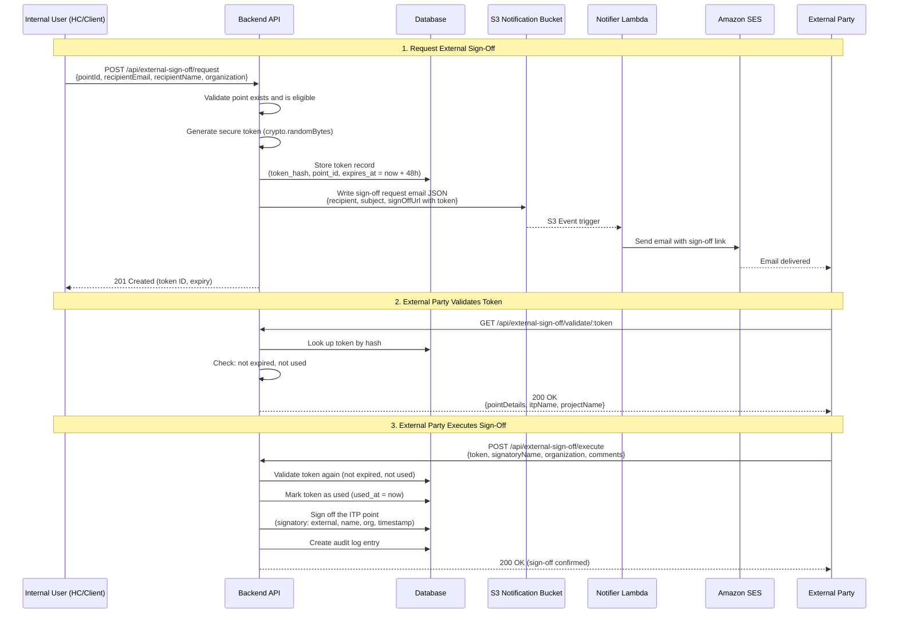

<!-- 
  Last Updated: 2025-07-06
  Covers: v1.0 of the application
  Maintainer: Development Team
-->

# External Sign-Off Flow

External sign-offs allow parties outside the system (third-party inspectors, regulatory bodies, consultants) to approve ITP points without needing a user account. A secure, time-limited token is generated and delivered via email.

---

## Sequence Diagram

---

## Process Steps

### 1. Request Sign-Off

An internal user (Head Contractor or Client) initiates the external sign-off request by providing:
- The ITP point to be signed off
- The external party's email address
- The external party's name and organization

The system generates a cryptographically secure token, stores its hash in the database, and sends an email containing a link with the plaintext token.

### 2. Token Delivery

The email contains:
- Project and ITP context (names, point description)
- A direct link to the sign-off page with the token as a URL parameter
- Expiry notice (48 hours from generation)
- Instructions for completing the sign-off

### 3. Token Validation

When the external party clicks the link, the frontend calls the validation endpoint. This confirms:
- The token exists and matches a stored hash
- The token has not expired (48-hour window)
- The token has not already been used

If valid, the response includes point details so the external party can review what they are signing off.

### 4. Execute Sign-Off

The external party reviews the point details and submits the sign-off with their name, organization, and optional comments. The system:
- Re-validates the token (prevents race conditions)
- Marks the token as used
- Records the sign-off on the ITP point
- Creates an audit trail entry

---

## Security Properties

| Property | Implementation |
|----------|---------------|
| Token generation | `crypto.randomBytes(32)` — 256-bit random token |
| Token storage | Only the SHA-256 hash is stored in the database |
| Expiry | 48 hours from generation (configurable) |
| Single use | Token is marked as used after execution; cannot be reused |
| No authentication required | External parties do not need an account |
| Audit trail | Token generation, validation attempts, and execution are all logged |

---

## Error Scenarios

| Scenario | Response |
|----------|----------|
| Token not found | 404 — Invalid or expired token |
| Token expired (>48 hours) | 410 — Token has expired |
| Token already used | 409 — Token has already been used |
| Point already signed off | 409 — Point has already been signed off |
| Point has open NCRs | 400 — Cannot sign off with open NCRs |

---

## Related Documentation

- [Point Sign-Off Flow](./point-sign-off.md) — How sign-offs work within the ITP
- [ITP Lifecycle](./itp-lifecycle.md) — Overall ITP state machine
- [User Guide: External Sign-Off](../user-guide/external-sign-off.md) — Step-by-step instructions
- [ADR-005: External Sign-Off Tokens](../adr/005-external-sign-off-tokens.md) — Design rationale

---

[← Back to Workflows Index](./README.md) | [← Back to Documentation Index](../README.md)
