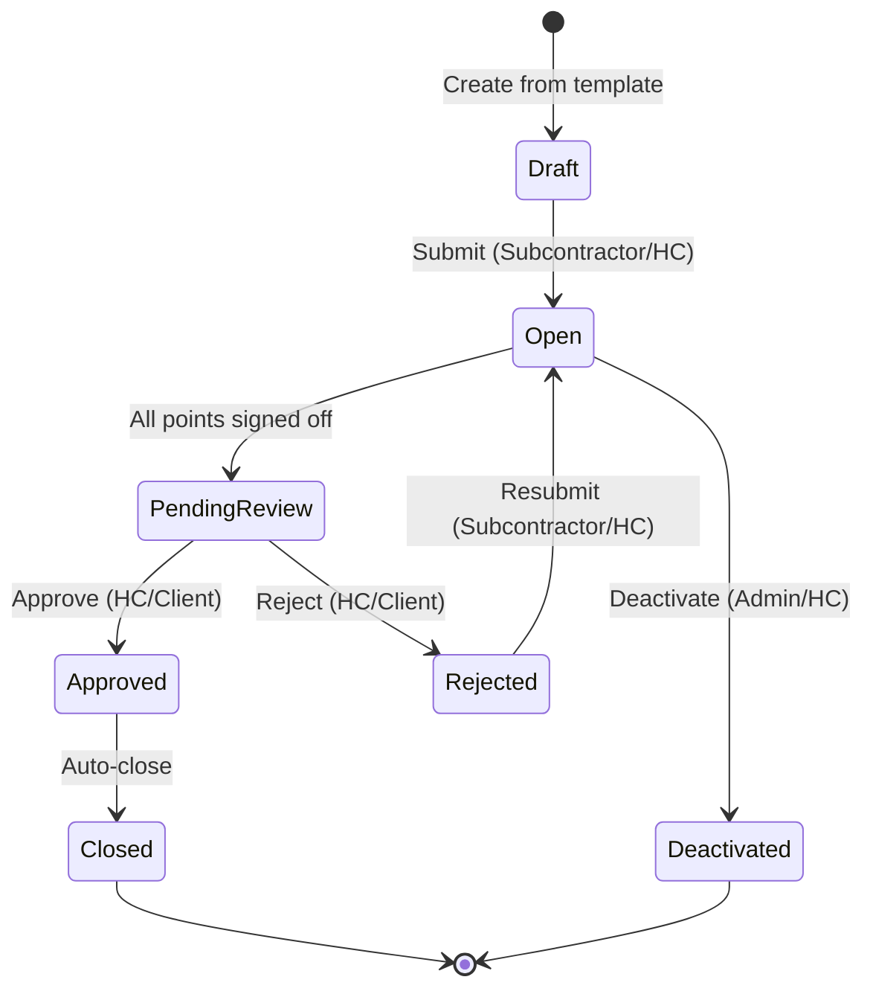

<!-- 
  Last Updated: 2025-07-06
  Covers: v1.0 of the application
  Maintainer: Development Team
-->

# ITP Lifecycle

The Inspection and Test Plan (ITP) lifecycle defines the states an ITP instance progresses through from creation to completion. Each state transition is triggered by a specific action and enforced by role-based permissions.

---

## State Diagram

---

## States

| State | Description |
|-------|-------------|
| **Draft** | Initial state. The ITP has been created from a template but is not yet active. Points cannot be signed off. Edits are allowed. |
| **Open** | Active state. Inspection points can be signed off by authorized roles. The ITP is in progress on site. |
| **Pending Review** | All individual points have been signed off. The ITP is awaiting final approval from the Head Contractor or Client. |
| **Approved** | The ITP has been reviewed and accepted. Automatically transitions to Closed. |
| **Rejected** | The ITP was reviewed and not accepted. Can be resubmitted to return to Open for further work. |
| **Closed** | Terminal state. The ITP is complete and forms part of the permanent quality record. No further changes allowed. |
| **Deactivated** | Terminal state. The ITP was cancelled or is no longer needed. Preserves the record without completing the lifecycle. |

---

## Transitions

| From | To | Trigger | Who Can Do It |
|------|----|---------|---------------|
| — | Draft | Create ITP from template | Subcontractor, Head Contractor, Admin |
| Draft | Open | Submit ITP | Subcontractor, Head Contractor, Admin |
| Open | Pending Review | Last point signed off (automatic) | System (triggered by point sign-off) |
| Open | Deactivated | Deactivate ITP | Head Contractor, Admin |
| Pending Review | Approved | Approve ITP | Head Contractor, Client |
| Pending Review | Rejected | Reject ITP | Head Contractor, Client |
| Rejected | Open | Resubmit ITP | Subcontractor, Head Contractor |
| Approved | Closed | Auto-close | System (automatic) |

---

## Key Rules

1. **Points cannot be signed off in Draft** — The ITP must be submitted (moved to Open) before any inspection work begins.
2. **Auto-transition to Pending Review** — When the last point is signed off, the system automatically moves the ITP to Pending Review. No manual action required.
3. **Rejection allows rework** — A rejected ITP returns to Open, where point sign-offs can be revised or additional work completed.
4. **Auto-close on approval** — Approval immediately closes the ITP. There is no separate "close" action.
5. **Deactivation is terminal** — A deactivated ITP cannot be reopened. Use this for cancelled work.
6. **Deletion** — ITPs in Draft status can be permanently deleted. Once submitted, they can only be deactivated.

---

## Related Documentation

- [Point Sign-Off Flow](./point-sign-off.md) — How individual points are approved within an Open ITP
- [NCR Lifecycle](./ncr-lifecycle.md) — How NCRs interact with point sign-off
- [User Guide: ITP Management](../user-guide/itp-management.md) — Step-by-step instructions

---

[← Back to Workflows Index](./README.md) | [← Back to Documentation Index](../README.md)
