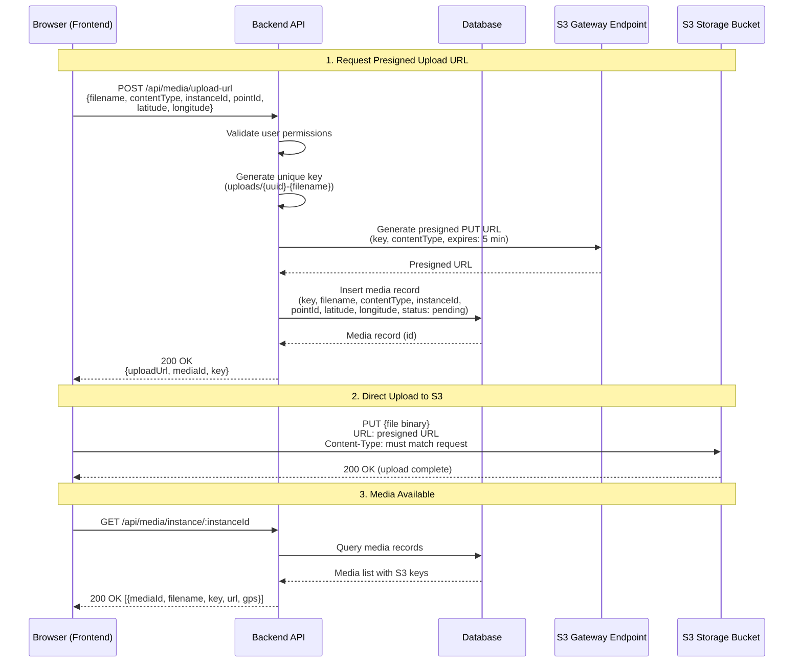

<!-- 
  Last Updated: 2025-07-06
  Covers: v1.0 of the application
  Maintainer: Development Team
-->

# Media Upload Flow

Media files (photos, documents) are uploaded directly to S3 using presigned URLs. The backend never proxies file content — it generates a time-limited upload URL and stores metadata in the database.

---

## Sequence Diagram

---

## Process Steps

### 1. Request Presigned URL

The frontend sends a request with file metadata:

| Field | Required | Description |
|-------|----------|-------------|
| filename | Yes | Original filename (used in S3 key) |
| contentType | Yes | MIME type (e.g., image/jpeg, application/pdf) |
| instanceId | Yes | ITP instance the media belongs to |
| pointId | No | Specific point the media is attached to |
| latitude | No | GPS latitude from device (decimal degrees) |
| longitude | No | GPS longitude from device (decimal degrees) |

The backend:
1. Validates the user has permission to upload to this instance
2. Generates a unique S3 key: `uploads/{uuid}-{filename}`
3. Creates a presigned PUT URL via the S3 Gateway Endpoint (expires in 5 minutes)
4. Inserts a media metadata record in the database
5. Returns the presigned URL and media ID to the frontend

### 2. Direct Upload to S3

The frontend uploads the file directly to S3 using the presigned URL:
- The `Content-Type` header must exactly match what was specified in step 1
- The upload goes directly from the browser to S3 (no Lambda proxy)
- The presigned URL expires after 5 minutes if not used

### 3. Access Media

After upload, media is accessible via:
- **By instance:** GET /api/media/instance/:instanceId — all media for an ITP
- **By point:** GET /api/media/point/:pointId — media for a specific point

---

## Key Design Properties

| Property | Detail |
|----------|--------|
| **No proxy overhead** | Files go directly from browser to S3, avoiding Lambda's 6 MB payload limit |
| **Presigned URL security** | URLs expire after 5 minutes and are scoped to a specific key and content type |
| **GPS metadata** | Latitude/longitude captured from the device are stored in the database alongside the media record |
| **S3 Gateway Endpoint** | Backend generates presigned URLs via the free VPC Gateway Endpoint |
| **CORS configured** | Storage bucket allows PUT from the frontend origin |
| **Content-Type enforcement** | The presigned URL is locked to the declared content type — mismatches are rejected by S3 |

---

## Deletion Rules

| Condition | Can Delete? |
|-----------|-------------|
| Point not signed off | Yes — Subcontractor, Head Contractor, Admin |
| Point signed off | No — media is part of the quality record |
| ITP closed | No — all media is permanently preserved |

---

## Error Scenarios

| Scenario | Response |
|----------|----------|
| Invalid instance ID | 404 — Instance not found |
| No permission for instance | 403 — Insufficient permissions |
| Presigned URL expired | S3 returns 403 — frontend should request a new URL |
| Content-Type mismatch | S3 returns 403 — must match the declared type |
| Delete after sign-off | 400 — Cannot delete media after point sign-off |

---

## Related Documentation

- [Architecture Overview](../architecture.md#media-upload-flow) — System-level media upload architecture
- [User Guide: Media Management](../user-guide/media-management.md) — Step-by-step instructions
- [API Reference: Media](../api/media.md) — Endpoint documentation

---

[← Back to Workflows Index](./README.md) | [← Back to Documentation Index](../README.md)
