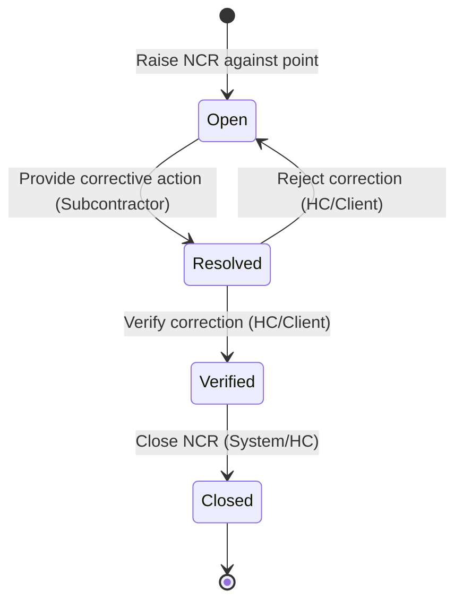
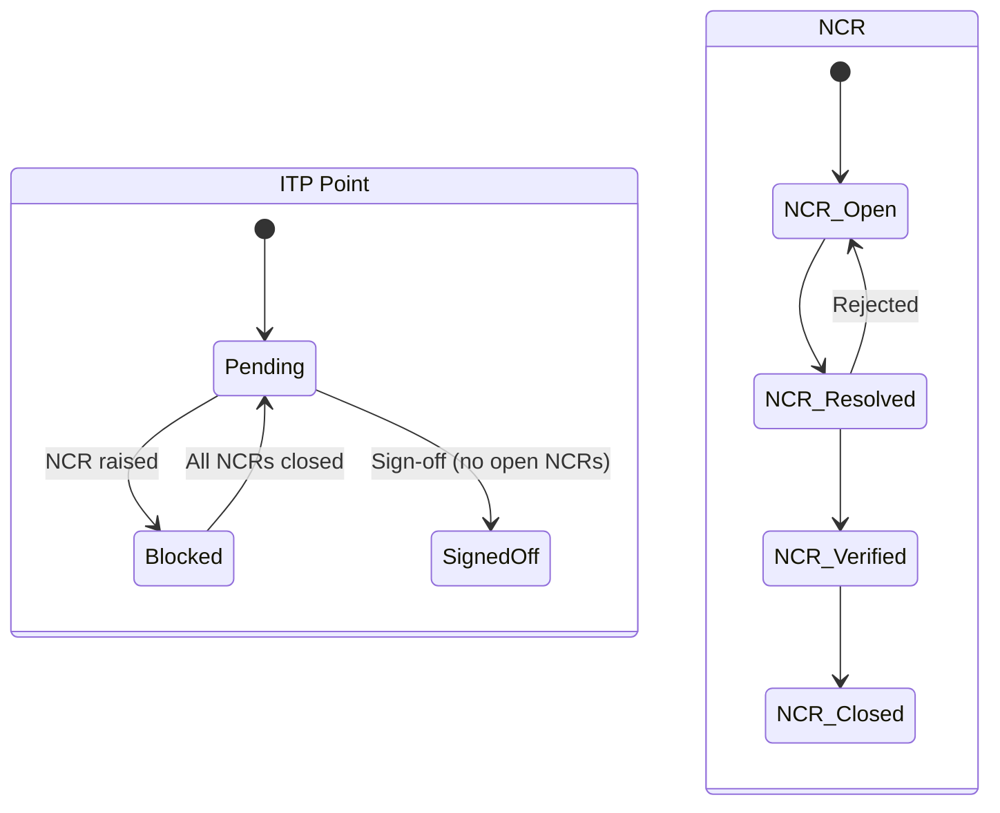

<!-- 
  Last Updated: 2025-07-06
  Covers: v1.0 of the application
  Maintainer: Development Team
-->

# NCR Lifecycle

Non-Conformance Reports (NCRs) track defects discovered during inspections. Each NCR is linked to a specific ITP point and progresses through a defined lifecycle from identification to closure.

---

## State Diagram

---

## States

| State | Description |
|-------|-------------|
| **Open** | A non-conformance has been identified and documented. The associated ITP point is blocked from sign-off. Corrective action is required. |
| **Resolved** | A corrective action has been provided by the responsible party. Awaiting verification by the Head Contractor or Client. |
| **Verified** | The corrective action has been inspected and confirmed as adequate. The NCR is ready to close. |
| **Closed** | Terminal state. The non-conformance has been fully addressed. The associated ITP point is unblocked for sign-off. |

---

## Transitions

| From | To | Trigger | Who Can Do It |
|------|----|---------|---------------|
| — | Open | Raise NCR against an ITP point | Subcontractor, Head Contractor, Client, Admin |
| Open | Resolved | Submit corrective action details | Subcontractor, Head Contractor |
| Resolved | Verified | Verify the corrective action is adequate | Head Contractor, Client |
| Resolved | Open | Reject the corrective action (rework needed) | Head Contractor, Client |
| Verified | Closed | Close the NCR | Head Contractor, Admin |

---

## Key Rules

1. **NCRs block point sign-off** — While any NCR linked to a point has status Open or Resolved (not yet Closed), the point cannot be signed off.
2. **Multiple NCRs per point** — A single point can have multiple NCRs. All must be Closed before the point is unblocked.
3. **Rejection returns to Open** — If the corrective action is inadequate, the NCR returns to Open for rework. This can cycle multiple times.
4. **NCR details are immutable after closure** — Once Closed, the NCR record cannot be modified. It forms part of the permanent quality record.
5. **Notification on creation** — When an NCR is raised, email notifications are sent to relevant project stakeholders via the S3 notification pattern.

---

## NCR Record Contents

Each NCR captures the following information:

| Field | When Recorded | Description |
|-------|--------------|-------------|
| Description | On creation (Open) | Detailed description of the non-conformance |
| Location/Reference | On creation (Open) | Where the defect was found |
| Root Cause | On resolution (Resolved) | Why the non-conformance occurred |
| Corrective Action | On resolution (Resolved) | What was done to fix the defect |
| Disposition | On resolution (Resolved) | How the defect was handled (rework, accept, etc.) |
| Verification Notes | On verification (Verified) | Confirmation that the fix is adequate |

---

## Interaction with ITP Lifecycle

When all NCRs linked to a point reach Closed status, the point becomes eligible for sign-off (subject to HP blocking and role checks).

---

## Related Documentation

- [Point Sign-Off Flow](./point-sign-off.md) — How NCR blocking fits into the sign-off process
- [ITP Lifecycle](./itp-lifecycle.md) — Overall ITP state machine
- [User Guide: NCR Management](../user-guide/ncr-management.md) — Step-by-step instructions

---

[← Back to Workflows Index](./README.md) | [← Back to Documentation Index](../README.md)
