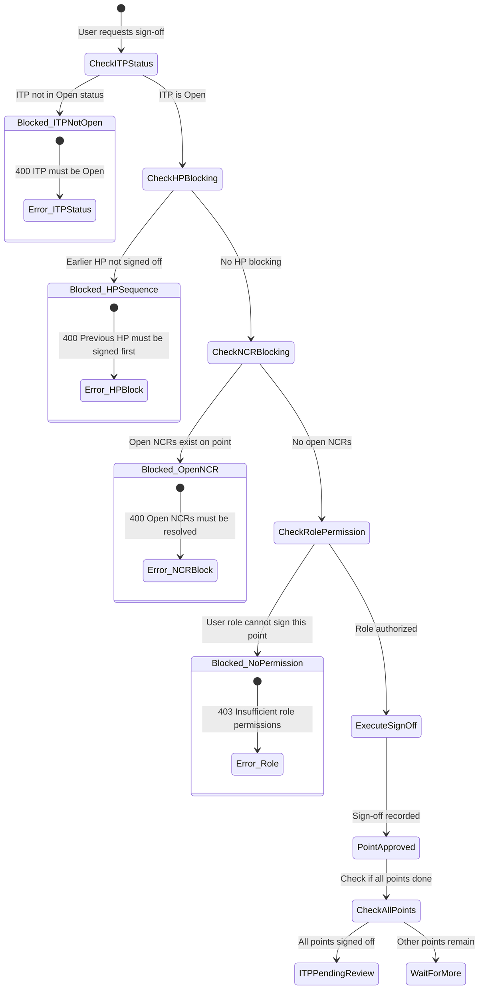

<!-- 
  Last Updated: 2025-07-06
  Covers: v1.0 of the application
  Maintainer: Development Team
-->

# Point Sign-Off Flow

The point sign-off flow defines the checks and validations that occur when a user attempts to sign off an inspection point within an ITP. Multiple blocking conditions must be satisfied before a sign-off is accepted.

---

## Flow Diagram

---

## Validation Steps

### 1. ITP Status Check

The ITP must be in **Open** status. Points cannot be signed off in Draft, Pending Review, Approved, Closed, or Deactivated states.

### 2. Hold Point (HP) Blocking

If the point being signed off has a sequence number, the system checks whether any earlier Hold Points (HPs) in the same ITP remain unsigned. Hold Points enforce sequential completion — you cannot skip ahead past an unsigned HP.

**Rule:** All Hold Points with a lower sequence number must be signed off before any point with a higher sequence number can be signed off.

### 3. NCR Blocking

The system checks whether any open (unresolved) NCRs exist against the specific point being signed off. A point with open NCRs cannot be approved until all NCRs are resolved, verified, and closed.

**Rule:** All NCRs linked to the point must have status = Closed before sign-off is allowed.

### 4. Role Permission Check

Each point type has defined roles that can sign it off. The system verifies the requesting user's role is authorized for the specific point.

| Point Type | Who Can Sign Off |
|-----------|-----------------|
| Hold Point (HP) | Head Contractor, Client, Admin |
| Witness Point (WP) | Head Contractor, Client, Admin |
| Review Point (RP) | Head Contractor, Client, Admin |
| Sample Point (SP) | Subcontractor, Head Contractor, Admin |
| Inspection Point (IP) | Subcontractor, Head Contractor, Admin |

### 5. Execute Sign-Off

Once all checks pass, the sign-off is recorded with:
- Signatory user ID and name
- Role at time of sign-off
- Timestamp
- Optional comments

### 6. Auto-Transition Check

After a successful sign-off, the system checks if all points in the ITP are now signed off. If so, the ITP automatically transitions to **Pending Review** status.

---

## Error Responses

| Condition | HTTP Status | Message |
|-----------|-------------|---------|
| ITP not in Open status | 400 | ITP must be in Open status to sign off points |
| HP blocking (earlier HP unsigned) | 400 | Previous Hold Point must be signed off first |
| Open NCRs on point | 400 | All NCRs must be resolved before sign-off |
| Role not authorized | 403 | Insufficient permissions to sign off this point type |
| Point already signed off | 409 | Point has already been signed off |

---

## Related Documentation

- [ITP Lifecycle](./itp-lifecycle.md) — Overall ITP state machine
- [NCR Lifecycle](./ncr-lifecycle.md) — How NCRs are resolved to unblock sign-off
- [User Guide: ITP Management](../user-guide/itp-management.md) — Step-by-step instructions

---

[← Back to Workflows Index](./README.md) | [← Back to Documentation Index](../README.md)
