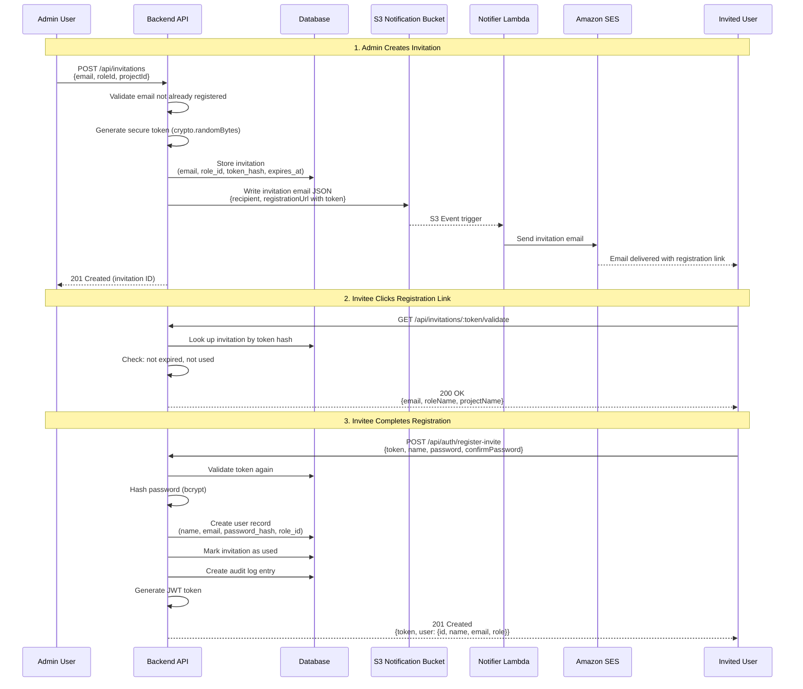

<!-- 
  Last Updated: 2025-07-06
  Covers: v1.0 of the application
  Maintainer: Development Team
-->

# User Onboarding Flow

User onboarding is invitation-based — there is no open registration. An administrator creates an invitation with a pre-assigned role, and the invited user receives an email with a secure registration link.

---

## Sequence Diagram

---

## Process Steps

### 1. Create Invitation

The Admin provides:
- **Email address** — Must not already be registered in the system
- **Role** — One of: Subcontractor, Head Contractor, Client, Admin
- **Project** — The project the user will be associated with

The system generates a secure token, stores its hash, and sends an invitation email.

### 2. Email Delivery

The invitation email contains:
- Welcome message with project context
- The assigned role
- A registration link with the token as a URL parameter
- Expiry notice (invitation tokens expire after 7 days)

### 3. Token Validation

When the invitee clicks the link, the frontend calls the validation endpoint to confirm:
- The token exists and matches a stored hash
- The invitation has not expired
- The invitation has not already been used

If valid, the response includes the pre-assigned email and role so the registration form can be pre-populated.

### 4. Complete Registration

The invitee provides:
- **Full name** — Display name in the system
- **Password** — Must meet complexity requirements (min 8 chars, uppercase, lowercase, number)
- **Confirm password** — Must match

The system creates the user account with the pre-assigned role and returns a JWT token, logging the user in immediately.

---

## Invitation Management

Admins can manage pending invitations:

| Action | Endpoint | Description |
|--------|----------|-------------|
| List pending | GET /api/invitations/pending | View all unaccepted invitations |
| Resend | POST /api/invitations/:id/resend | Re-send the invitation email |
| Revoke | DELETE /api/invitations/:id | Cancel a pending invitation |

---

## Key Rules

1. **No open registration** — Users can only join via invitation. The `/api/auth/register` endpoint is reserved for initial system setup.
2. **Role pre-assignment** — The Admin decides the role at invitation time. The invitee cannot change their role during registration.
3. **Single use** — Each invitation token can only be used once. After registration, the invitation is marked as used.
4. **7-day expiry** — Invitation tokens expire after 7 days. Admins can resend to generate a fresh token.
5. **Email uniqueness** — Cannot invite an email that is already registered or has a pending invitation.
6. **Immediate login** — After successful registration, the user receives a JWT and is logged in without needing to separately authenticate.

---

## Related Documentation

- [User Guide: Getting Started](../user-guide/getting-started.md) — Registration from the invitee's perspective
- [User Guide: User Administration](../user-guide/user-administration.md) — Managing invitations from the Admin's perspective
- [External Sign-Off Flow](./external-sign-off.md) — Similar token-based flow for external parties

---

[← Back to Workflows Index](./README.md) | [← Back to Documentation Index](../README.md)
