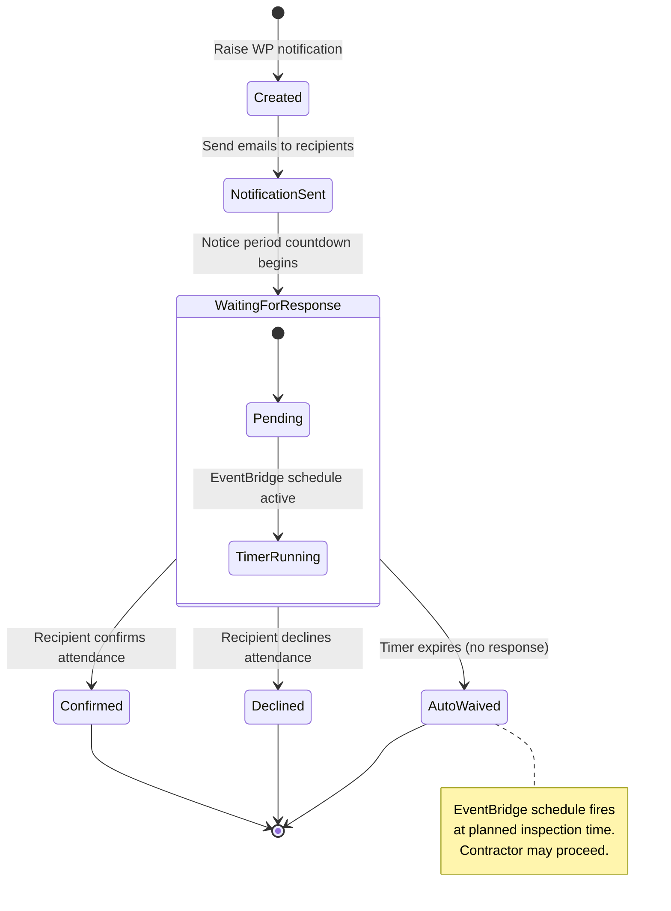
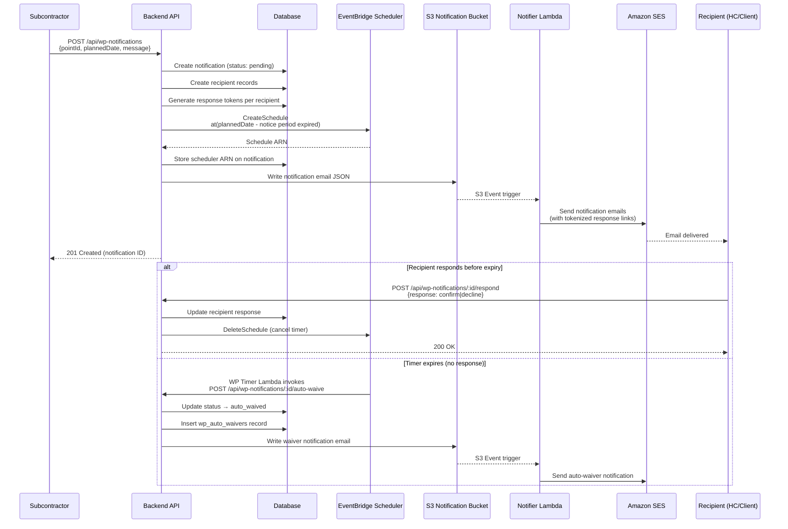

<!-- 
  Last Updated: 2025-07-06
  Covers: v1.0 of the application
  Maintainer: Development Team
-->

# Witness Point Notification Flow

Witness Points (WPs) require that stakeholders are notified before an inspection occurs. This workflow covers the full lifecycle from notification creation through response or auto-waiver.

---

## Flow Diagram

---

## Detailed Sequence

---

## States

| State | Description |
|-------|-------------|
| **Pending** | Notification has been created and emails sent. Waiting for recipient responses. Timer is running. |
| **Confirmed** | At least one recipient has confirmed they will attend the inspection. |
| **Declined** | All recipients have explicitly declined attendance. Contractor may proceed. |
| **Auto-Waived** | The notice period expired without any response. The system automatically waives attendance and the contractor may proceed. |
| **Cancelled** | The notification was cancelled (e.g., inspection rescheduled). Timer is deleted. |

---

## Key Rules

1. **Notice period enforcement** — The planned inspection date must be at least the configured notice period (project-level setting) in the future when the notification is raised.
2. **One active notification per point** — Only one pending notification can exist for a given WP at a time.
3. **Token-based external response** — Recipients can respond via a tokenized link in the email without logging into the system.
4. **Timer cancellation on response** — When any recipient responds (confirm or decline), the EventBridge schedule is cancelled.
5. **Auto-waiver is idempotent** — If the timer fires but the notification was already responded to or cancelled, the auto-waive is a no-op.
6. **Sweep Lambda fallback** — A sweep Lambda runs every 5 minutes to catch any missed expirations where the schedule failed to fire.
7. **Cancellation** — Notifications can be cancelled before expiry, which deletes the EventBridge schedule and marks the notification as cancelled.

---

## Configuration

Projects can configure witness point behavior:

| Setting | Description | Default |
|---------|-------------|---------|
| Notice Period | Minimum hours before planned inspection | 24 hours |
| Default Recipients | Users automatically added to all WP notifications | None |
| Auto-waiver enabled | Whether auto-waiver is active | Yes |

---

## Related Documentation

- [ITP Lifecycle](./itp-lifecycle.md) — How WPs fit into the overall ITP workflow
- [Point Sign-Off Flow](./point-sign-off.md) — Sign-off process for witness points
- [User Guide: Witness Points](../user-guide/witness-points.md) — Step-by-step instructions

---

[← Back to Workflows Index](./README.md) | [← Back to Documentation Index](../README.md)
